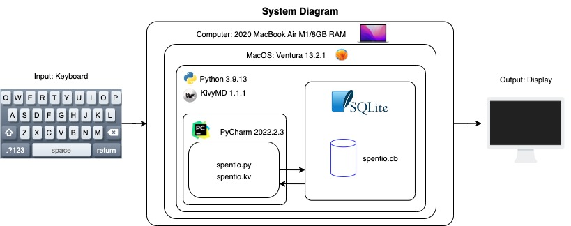
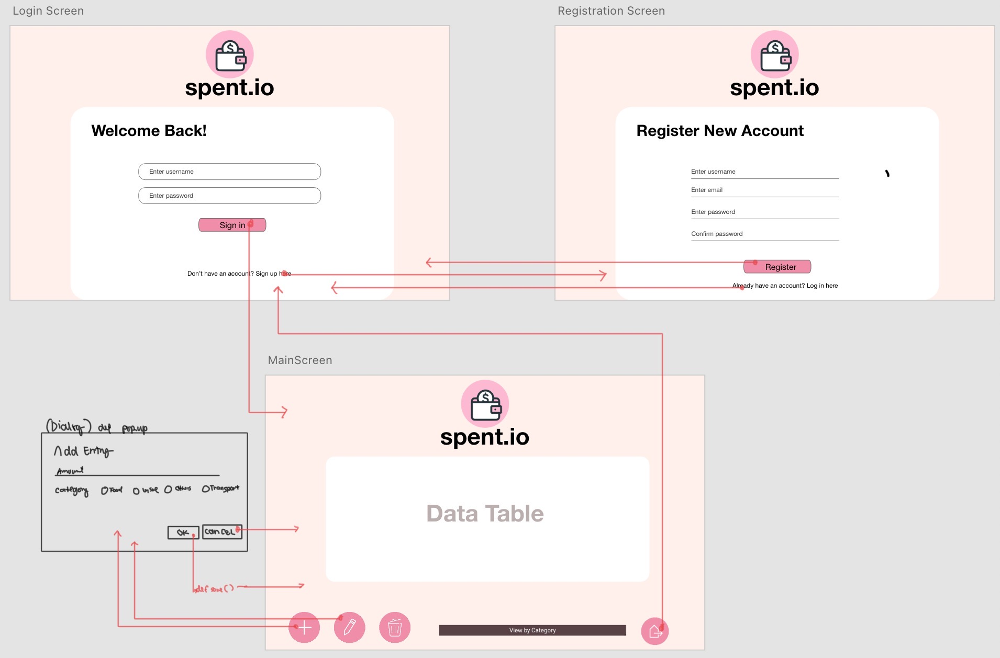
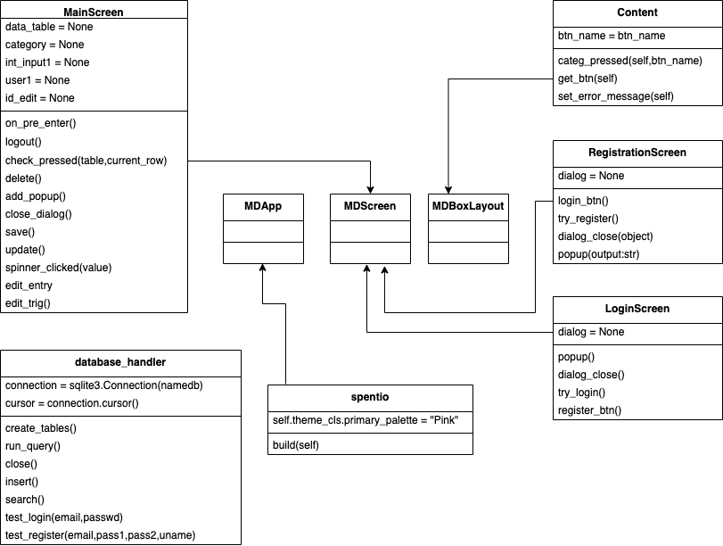
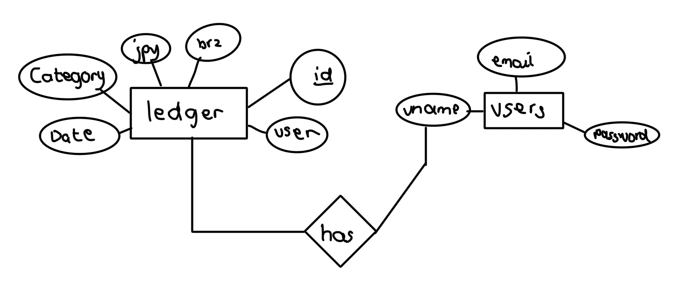
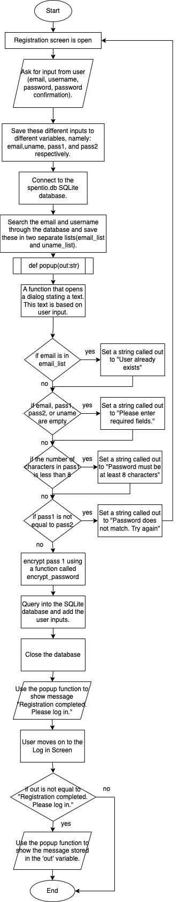
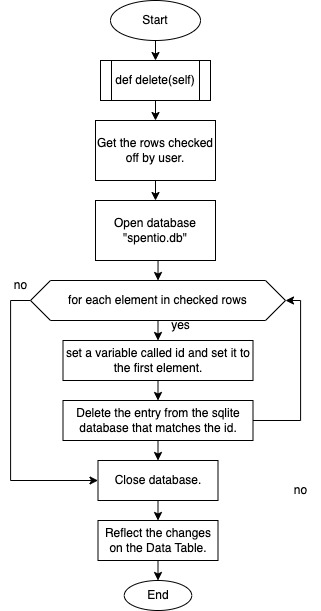
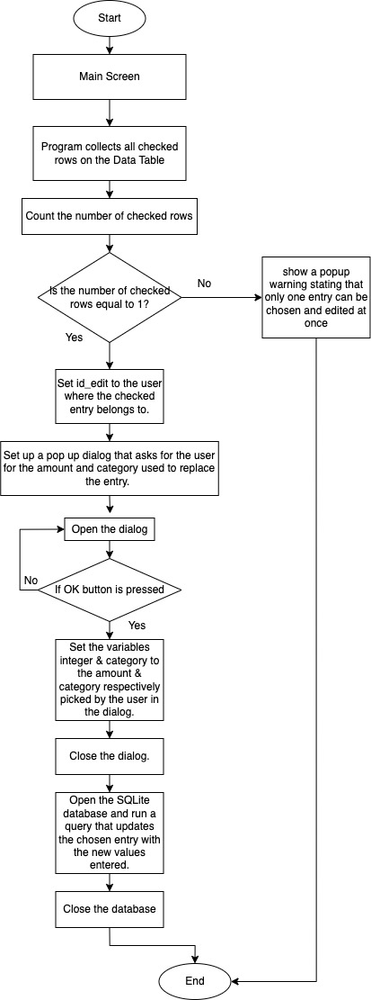

# Unit 3. Expenses Tracker App for Emmy Abella Dominguez da Silva 


# Criteria A: Planning
## Problem Definition

Emmy Abella Domingues is an 18-year-old IB Year 1 student from Brazil. As an international & boarding student in UWC ISAK Japan, money management is a major aspect of her life. Although Emmy easily keep tracks of her income or cash inflow, she finds it hard to keep track of her expenses. Specifically, she finds it difficult to note what, when, and how much she spends on.

The client, Emmy Domingues, is in need of an app that keeps track of her expenses. In addition, the client requires the app to be encrypted through a login system, for the data to be stored in a database, and for the user interface to be clear, concise, and most importantly attractive by using the client's favorite color, pink.

## Design Statement
I will design and develop a digital expenses ledger for Emmy Abella Domingues da Silva who is struggling to keep track of her expenses as an international student. The proposed solution is an application programmed using the Python programming language, KivyMD for the Graphic User Interface (GUI) construction, and SQLite for local database[^1]. The program will be developed and completed in a span of 4 weeks and will be evaluated based on the success criteria stated prior to this statement; the success criteria are objectives to be met by the developer approved by the client based on their needs and preferences.

## Rationale for Proposed Solution
The proposed solution is an expense tracking application that allows users to keep track of their expenses, categorize them into the client's main expenditure type (Food, Transportation, Emergency & Healthcare, Leisure, and Miscellaneous), and monitor their spending. The app is necessary for people who want to stay on top of their finances and make informed financial decisions. The app provides users with a comprehensive overview of their spending habits, which is crucial for budgeting, planning, and saving.

The app includes a login & register system to provide an added layer of security by ensuring that only authorized users can access the app and its data. It also ensures that the user's data is private and personal to the authorized user, protecting sensitive information such as financial data, personal details, and transaction history. The user interface uses a color scheme that only includes colors in the shade of pink, as per request of the client. The interface is clear, concise, and attractive, making it easy for users to navigate and use the app. The app allows the user to add entries as the expense tracking app's basic functionality. In addition, it allows users to edit and delete entries just in case the user inputs an entry wrongly the first time.

The developer shall use Python, a popular programming language widely used in the development of web applications, scientific computing, and data analysis[^1]. The developer chose Python as it is a versatile language that is easy to learn and has a large community of developers who contribute to its development. Along with Python is kivyMD, a Python-based library use for developing user interfaces[^2]. The developer chose kivyMD because it is open source and it is a popular choice for app development among the Python developers community, due to its apparent simplicity, flexibility, and scalability. kivyMD provides a wide range of widgets, animations, and effects, making it easy to develop attractive and responsive user interfaces[^4]. Lastly, SQLite is chosen for the application's database management system due to its simplicity, reliability, and portability. SQLite offers a lightweight database management system and can be integrated with Python[^3]. SQLite is also scalable, meaning it can handle large amounts of data and is suitable for developing an expense tracking app. It is self-contained thus a separate server is not required[^3].

In summary, the proposed solution is an expense tracking app that is necessary for people who want to stay on top of their finances. The app includes a login system, a database management system, a user interface, expense tracking, encryption, and personalization. Python, kivyMD, and SQLite are the best choices for developing the app because of their simplicity, flexibility, and reliability.


## Success Criteria
1. The solution is an application that provides a presentation of the user's expenses in a tabular format.
2. The application is able to add, edit, or delete entries to the app's database and present these changes. Each entry stores the date automatically, the amount spent, and the category of the expense.
3. The data table automatically converts the JPY amount to BZR to enable the user to visualize how much she spent in the currency she is used in.
3. The application is kept secure by embedding a log in system and a registration system to add users.
4. The user's data of expenses are stored in a SQLLite database.
5. The application is up to the user's visual standard by using only shades of the user's favorite color, pink.
6. The user's expenses are categorized into Food, Transportation, Emergency, Leisure, and Others. 


# Criteria B: Design
## Diagrams

### System Diagrams


*Fig. 1 System Diagram of the spent.io app*
### Wireframes


*Fig. 2 Wireframe of the spent.io app created on Adobe XD*


### UML Diagram


*Fig. 3 UML Diagram of the spent.io app*

Figure 3 shows the classes and methods found in each class used to develop the application. The classes exhibit in either three parent classes found in the KivyMD Library: MDApp, MDScreen, and MDBoxLayout. All subclasses inherit methods and attributes from these parent classes.

### ER Diagram


*Fig 4. ER diagram of the spent.io app database spentio.db(SQLite).*

Figure 4 shows the different entities involved in the app's database and how these different entities relate to each other. Here, we can see that the SQLite database has two tables called ledger and users. The users database stores all the user's account information (hashed password, email, and username) and for each user registered in the users table, there are entries in the ledger table that belong only to that specific user.


### Flowcharts
**Registration System**



*Fig 5. Flowchart of the spent.io app entry editing algorithm*


**Delete Entry** 





*Fig 6. Flowchart of the spent.io app entry deletion algorithm*

**Entry Editing**



*Fig 7. Flowchart of the spent.io app entry editing algorithm*


## Record of Tasks
| Task No | Planned Action                                                                                                                                                                                                                                                                                                                                                                                                                                                                                 | Planned Outcome                                                                                                                                                                                                                                                                                                                                                                                     | Time estimate | Target completion date | Criterion |
|---------|------------------------------------------------------------------------------------------------------------------------------------------------------------------------------------------------------------------------------------------------------------------------------------------------------------------------------------------------------------------------------------------------------------------------------------------------------------------------------------------------|-----------------------------------------------------------------------------------------------------------------------------------------------------------------------------------------------------------------------------------------------------------------------------------------------------------------------------------------------------------------------------------------------------|---------------|------------------------|-----------|
| 1       | Identify & interview the client                                                                                                                                                                                                                                                                                                                                                                                                                                                                |                                                                                                                                                                                                                                                                                                                                                                                                     | 6 min         | Feb 9                  | A         |
| 2       | Write the context of the problem                                                                                                                                                                                                                                                                                                                                                                                                                                                               | Establish the problem identified in a clear and concise manner. The problem definition must include who the client is, what the client wants, and indicate a possible solution.                                                                                                                                                                                                                     | 15 min        | Feb 9                  | A         |
| 3       | Brainstorm and write a proposed solution for the problem. Rationalize this solution for the client.                                                                                                                                                                                                                                                                                                                                                                                            | Explain in a concise and clear manner the purpose of the project to the client                                                                                                                                                                                                                                                                                                                      | 5 min         | Feb 9                  | A         |
| 4       | Write the success criteria of the proposed solution.                                                                                                                                                                                                                                                                                                                                                                                                                                           | A clear set standards to be met by the developer, that suits the client's needs and preferences.                                                                                                                                                                                                                                                                                                    | 15 min        | Feb 10                 | A         |
| 5       | Meet with the client to confirm or revise success criteria.                                                                                                                                                                                                                                                                                                                                                                                                                                    | Confirmed success criteria and ensure it meets the client's standards.                                                                                                                                                                                                                                                                                                                              | 15 min        | Feb 10                 | A         |
| 6       | Write a design statement for the proposed solution 'spent.io'                                                                                                                                                                                                                                                                                                                                                                                                                                  | A coherent design statement that outlines the plan for the project.                                                                                                                                                                                                                                                                                                                                 | 20 min        | Feb 10                 | A         |
| 7       | Draw a system diagram for the proposed app solution: 'spent.io'                                                                                                                                                                                                                                                                                                                                                                                                                                | Have a concrete idea of the software and hardware requirements involved in the development of the application.                                                                                                                                                                                                                                                                                      | 10 min        | Feb 10                 | B         |
| 8       | Plan & create the wireframe for the proposed solution: 'spent.io'. The wireframe includes 3 screens: Login Screen, Registration Screen, and Main Screen. This wireframe plan must include the widgets to be shown, components (ex. Dialog, MDButton), dimensions of each screens, components, and color schemes. This must also outline the transition from one screen to another and how this is done. More importantly, the planned wireframe must align with the client's success criteria. | Have a detailed visual representation of the project which also serves as a guide for the developer during the programming process.                                                                                                                                                                                                                                                                 | 60 min        | Feb 11                 | B         |
| 9       | Develop the `database_handler` class which enables the developer to use SQLite with Python further.                                                                                                                                                                                                                                                                                                                                                                                            | The `database_handler` class has the attributes `connection` which connects to an existing SQLite database named "spentio.db" and `cursor`. The class includes the following methods:`create_tables`,`run_query`,`close`, `insert`,`search`,`test_login`,and `test_register`.                                                                                                                       | 45 min        | Feb 13                 | C         |
| 10      | Develop the Login Screen GUI for the proposed app 'spent.io' based on the planned Wireframe using Python and the KivyMD Library.                                                                                                                                                                                                                                                                                                                                                               | A screen containing text fields which allows the user to input log in credentials.                                                                                                                                                                                                                                                                                                                  | 30 min        | Feb 13                 | C         |
| 11      | Develop the`LoginScreen` class in the spentio.py file which inherits from a KivyMD Component `MDScreen`. This class shall have an attribute called `dialog` originally set to None.                                                                                                                                                                                                                                                                                                            | A secure program allowing the user to login to the application using an existing username or email and password.                                                                                                                                                                                                                                                                                    | 50 min        | Feb 14                 | C         |
| 12      | Develop password encryption secure_password.py                                                                                                                                                                                                                                                                                                                                                                                                                                                 | A python file containing the `encrypt_password` class which take's a user's password and encrypt it using sha256 before being strored in the SQLite database spentio.db                                                                                                                                                                                                                             | 45 min        | Feb 16                 | C         |
| 13      | Develop the Registration Screen GUI for the proposed app 'spent.io' based on the planned Wireframe.                                                                                                                                                                                                                                                                                                                                                                                            | Have a screen that follows the Wireframe Diagram and allows the user to register a new account. In this step however, the screen is still limited given that it's still merely a GUI, with no methods connected to its graphic components whatsoever.                                                                                                                                               | 45 min        | Feb 16                 | C         |
| 14      | Develop the `RegistrationScreen` class in the spentio.py file.                                                                                                                                                                                                                                                                                                                                                                                                                                 | Have a screen that allows the user to register a new account (username, email, and password) and save these data into the 'users' table of an SQLite database titled 'spentio.db'                                                                                                                                                                                                                   | 120 min       | Feb 16                 | C         |
| 15      | Design button icons on Canva for the MainScreen GUI.                                                                                                                                                                                                                                                                                                                                                                                                                                           | Four button png images are created. A '+' icon button to represent entry addition, a button with a pencil icon to represent entry edit, a trash icon button to represent entry deletion, and a logout icon to represent logging out.                                                                                                                                                                | 20 min        | Feb 17                 | C         |
| 16      | Develop the MainScreen GUI for the proposed app 'spent.io' based on the planned Wireframe.                                                                                                                                                                                                                                                                                                                                                                                                     | A screen featuring the app logo, name, and the buttons previously created.                                                                                                                                                                                                                                                                                                                          | 30 min        | Feb 17                 | C         |
| 17      | Develop a DataTable showing data from the `ledger` table from spentio.db and present this on the Main Screen page.                                                                                                                                                                                                                                                                                                                                                                             | A data table that shows data from the 'ledger' table of the 'spentio.db' can be seen on the Main Screen.                                                                                                                                                                                                                                                                                            | 45 min        | Feb 20                 | C         |
| 18      | Develop the `MainScreen` class in the spentio.py file.                                                                                                                                                                                                                                                                                                                                                                                                                                         | This class includes methods (further explained in this documentation's Computation Thinking section) that allows the user to use the main functionalities of the app.                                                                                                                                                                                                                               | 2 hours       | Feb 20                 | C         |
| 19      | Develop methods in the `MainScreen` class to enable the 'Add Entry' button to function on the Main Screen. This includes an MDDialog that asks for the user's expense (integer) through a TextField and expense category through a group of checkboxes that accepts one input. This dialog has two buttons: 'CANCEL' to cancel entry and go back to MainScreen, and 'OK' to add entry to the database.                                                                                         | When the 'Add Entry' icon button is clicked, a Dialog opens to ask for user input. The inputs are validated and when valid, after the user presses 'OK', the dialog closes and data is stored in the 'ledger' table of the spentio.db SQLite database. These changes in the database are reflected on the Data Table.                                                                               | 50 min        | Feb 21                 | C         |
| 20      | Develop methods in the `MainScreen` to enable the 'Edit Entry' button to function on the Main Screen.                                                                                                                                                                                                                                                                                                                                                                                          | A checkbox is clicked on the Data Table. Once the 'Edit Entry' icon button is clicked, a Dialog opens to ask for user input. The inputs are validated and when valid, after the user presses 'OK', the dialog closes and row of data checked by the user previously is now updated with the newly inputted entries. These changes are also reflected on the SQLite database, spentio.db ledger table. | 1 hour        | Feb 22                 | C         |
| 21      | Develop methods in the `MainScreen` to enable the `Delete Entry` button to function on the Main Screen.                                                                                                                                                                                                                                                                                                                                                                                        | Once the user picks entries on the data table by ticking off check boxes and the delete entry icon button is pressed, entries are deleted and are no longer shown in the data table. These entries/rows are also deleted on the SQLite database spentio.db ledger table.                                                                                                                            | 20 min        | Feb 24                 | C         |
| 22      | Develop a widget on the MainScreen to allow the user to look through the database based on the Category.                                                                                                                                                                                                                                                                                                                                                                                       | Once pressed, rows of text buttons with expense categories as titles are shown. Once one of the buttons is pressed, the Data Table automatically only shows entries/rows under that certain category.                                                                                                                                                                                               | 40 min        | Feb 24                 | C         |
| 23      | Develop a button on the Main Screen that allows the user to logout.                                                                                                                                                                                                                                                                                                                                                                                                                            | The logout button logs out the user and takes them back to the first page which is the Login Screen.                                                                                                                                                                                                                                                                                                | 20 min        | Feb 24                 | C         |
| 24      | Write the test plan.                                                                                                                                                                                                                                                                                                                                                                                                                                                                           | Have a clear idea of factors and components of the app to look into, and see whether these are up to standard.                                                                                                                                                                                                                                                                                      | 30 min        | Feb 26                 | B         |
| 25      | Beta Testing                                                                                                                                                                                                                                                                                                                                                                                                                                                                                   | Gauge the app's functionality, security, and visual layout by having the client, Emmy Abella, test the app. Take notes of certain comments, suggestions, and concerns and present app amendments to the user.                                                                                                                                                                                       | 15 min        | Feb 28                 | C         |
| 26      | Beta Development: Login Screen & Registration Screen input validation.                                                                                                                                                                                                                                                                                                                                                                                                                         | Code changes into the app based on feedback given by client from the previous step.                                                                                                                                                                                                                                                                                                                 | 80 min        | Feb 28                 | C         |
| 27      | Rewrite the test plan.                                                                                                                                                                                                                                                                                                                                                                                                                                                                         | Update the test plan with the new components developed after client's feedback.                                                                                                                                                                                                                                                                                                                     | 30 min        | Mar 1                  | B         |
| 28      | Testing (using revised test plan)                                                                                                                                                                                                                                                                                                                                                                                                                                                              | Use the test plan. By this point, it is expected for every component stated to be up to standard.                                                                                                                                                                                                                                                                                                   | 30 min        | Mar 2                  | C         |
| 29      | Create flow diagrams of chunks of the code on spentio.py and write brief explanataions for each.                                                                                                                                                                                                                                                                                                                                                                                               | Have accurate and comprehensive representations of how parts of the program/code works with brief explanations.                                                                                                                                                                                                                                                                                     | 40 min        | Mar 5                  | B         |
| 30      | Meet with the client and present the final product.                                                                                                                                                                                                                                                                                                                                                                                                                                            | Meet with client to deliver the final product (the application).                                                                                                                                                                                                                                                                                                                                    | 20 min        | Mar 6                  | A         |
| 31      | Write & finish Criteria C.                                                                                                                                                                                                                                                                                                                                                                                                                                                                     | Write about the techniques and resources used in the code, and how these came to be.                                                                                                                                                                                                                                                                                                                | 40 min        | Mar 7                  | A         |
| 32      | Go through and revise the project's documentation.                                                                                                                                                                                                                                                                                                                                                                                                                                             | Ensure that the documentation is accurate, comperehensible for the client, and follows proper citations.                                                                                                                                                                                                                                                                                            | 40 min        | Mar 8                  | A         |
| 33      | Finish video for Criteria D.                                                                                                                                                                                                                                                                                                                                                                                                                                                                   | A video evidence of all the success criterias functioning and working within the developed application.                                                                                                                                                                                                                                                                                             | 30 min        | Mar 9                  | D         |


## Test Plan
| Test No | Test Type                                                                                            | Date   | Procedure                                                                                                                                                                                                                                                                                                                                                                                                                                                                                                                                                                                                                                                                                                                                                                                                              | Expected Outcome                                                                                                                                                                                                                                                                                    |
|---------|------------------------------------------------------------------------------------------------------|--------|------------------------------------------------------------------------------------------------------------------------------------------------------------------------------------------------------------------------------------------------------------------------------------------------------------------------------------------------------------------------------------------------------------------------------------------------------------------------------------------------------------------------------------------------------------------------------------------------------------------------------------------------------------------------------------------------------------------------------------------------------------------------------------------------------------------------|-----------------------------------------------------------------------------------------------------------------------------------------------------------------------------------------------------------------------------------------------------------------------------------------------------| 
| 1       | Functional: Test  whether the SignUp screen succesfully registers new user if all entries are valid. | Feb 18 | Run python file (spentio.py). Go to sign up screen and enter the following values: <br/>- email: bob@isak<br/>- username: bob<br/>-password: bob123                                                                                                                                                                                                                                                                                                                                                                                                                                                                                                                                                                                                                                                                    | When the database, spentio.db is checked, a new row of data can be seen. This row shows the entered email, username, and password encrypted using a certain hash.                                                                                                                                   |  
| 2       | Functional: Test sign up screen when data inputted by user is invalid                                | Feb 18 | Run spentio.py. Navigate to the SignUp Screen. Enter the following values:<br/>-  email: bob@isak<br/>- username: bob2<br/>-password: bob123                                                                                                                                                                                                                                                                                                                                                                                                                                                                                                                                                                                                                                                                           | Once the sign up button is clicked and the user input is queried into the database, the application shows a dialog box that tells the user the exact error. In this case, since the email already exists due to the prior test step, the dialog will show "Email already exists. Please try again". |
| 3       | Functional: Data registered from a new user is stored securely in an SQLite Database.                | Feb 18 | After Test step 1 and 2, open the sqllite database console and view the users table.                                                                                                                                                                                                                                                                                                                                                                                                                                                                                                                                                                                                                                                                                                                                   | The users table must have the email, username, and a hashed password.                                                                                                                                                                                                                               |
| 4       | Functional: Test registration screen with invalid input (empty fields)                               | Feb 20 | username(''), email(''), pass1('bob'), pass2('12345')                                                                                                                                                                                                                                                                                                                                                                                                                                                                                                                                                                                                                                                                                                                                                                  | Feedback should be given to the user through a dialog stating the error ("Please input required fields").                                                                                                                                                                                           |
| 5       | Functional: Test registration screen with invalid input (existing username)                          | Feb 20 | username('bob'), email('bob4@isak'), pass1('bob'), pass2('12345')                                                                                                                                                                                                                                                                                                                                                                                                                                                                                                                                                                                                                                                                                                                                                      | Feedback should be given to the user through a dialog stating the error ("Username already exists. Please try again").                                                                                                                                                                              |
| 6       | Functional: Test registration screen with invalid input (mismatched passwords)                       | Feb 20 | Input: username('bob4'), email('bob4@isak'), pass1('bob'), pass2('12345')                                                                                                                                                                                                                                                                                                                                                                                                                                                                                                                                                                                                                                                                                                                                              | Feedback is given to the user by having the password text fields red.                                                                                                                                                                                                                               |
| 7       | Functional: Test registration screen with invalid input (existing email).                            | Feb 20 | Input: username('bob4'), email('bob@isak'), pass1('bob'), pass2('12345')                                                                                                                                                                                                                                                                                                                                                                                                                                                                                                                                                                                                                                                                                                                                               | Feedback should be given to the user through a dialog stating the error ("Email already exists. Please try again").                                                                                                                                                                                 |
| 8       | Functional: Test Login screen with valid input.                                                      | Feb 20 | Input the username and password registered during test step 1.                                                                                                                                                                                                                                                                                                                                                                                                                                                                                                                                                                                                                                                                                                                                                         | Once the login button is clicked, the app transitions to the Main Screen                                                                                                                                                                                                                            |
| 9       | Functional: Test login screen with invalid input (username that hasn't been registered prior).       | Feb 20 | Input a random username and password that haven't been registered to the application prior.                                                                                                                                                                                                                                                                                                                                                                                                                                                                                                                                                                                                                                                                                                                            | The application shows a dialog box stating that the 'User does not exist'.                                                                                                                                                                                                                          |
| 10      | Functional: Test login screen with invalid input (existing username but wrong password)              | Feb 20 | Input a previously registered username ('bob') or email ('bob@isak') and input a wrong or random password ('12345').                                                                                                                                                                                                                                                                                                                                                                                                                                                                                                                                                                                                                                                                                                   | The appplication's password textfield turns red.                                                                                                                                                                                                                                                    |
| 11      | Non-functional: Test the application's graphic interface with the client.                            | Feb 21 | Communicate with the client, Emmy Abella Domingues da Silva during Computer Science class.                                                                                                                                                                                                                                                                                                                                                                                                                                                                                                                                                                                                                                                                                                                             | The client approves of the color scheme, layout, and features of the application.                                                                                                                                                                                                                   |
| 12      | Functional: Database is shown in the database.                                                       | Feb 25 | Run spentio.py. Log in using valid inputs ('bob' and 'bob123' respectively). The Main Screen opens after a successful log in.                                                                                                                                                                                                                                                                                                                                                                                                                                                                                                                                                                                                                                                                                          | The main screen shows a data table showing data from a table in SQLLite. This datatable contains the following columns: checker, number, date, category, and amount.                                                                                                                                |
| 13      | Functional: Add Entry                                                                                | Feb 26 | On the main screen, click on the '+' button. There should be a dialogue shown, asking for an amount and for the user to click the category. Once done, click 'ok' to close dialog.                                                                                                                                                                                                                                                                                                                                                                                                                                                                                                                                                                                                                                     | Once new entry input is done, the datatable should be updated and the new entry should come up.                                                                                                                                                                                                     |
| 14      | Functional: Delete Entry                                                                             | Mar 1  | On the main screen, check rows on the data table then click on the delete icon button.                                                                                                                                                                                                                                                                                                                                                                                                                                                                                                                                                                                                                                                                                                                                 | The selected rows or entries are deleted; the changes are updated automatically on the SQLite database and the data table on the Main Screen.                                                                                                                                                       |
| 15      | Functional: Edit Entry (Multiple rows checked)                                                       | Mar 1  | On the main screen, tick off multiple rows and click edit icon button.                                                                                                                                                                                                                                                                                                                                                                                                                                                                                                                                                                                                                                                                                                                                                 | A dialog pops up on the Main Screen saying "Please pick only one row at a time to edit."                                                                                                                                                                                                            |
| 16      | Functional: Edit Entry (One row checked)                                                             | Mar 1  | On the main screen, tick off one row and then click the edit icon button.                                                                                                                                                                                                                                                                                                                                                                                                                                                                                                                                                                                                                                                                                                                                              | A dialog pops up on the Main Sceen asking the user for input (amount & category). Once OK is clicked, the changes are updated to the selected entry (both in the SQLite database and on the Data Table).                                                                                            |
| 17      | Functional: Validate new/edited entry                                                                | Mar 2  | On the main screen, click the add entry icon button. Input letters or a mix of characters.                                                                                                                                                                                                                                                                                                                                                                                                                                                                                                                                                                                                                                                                                                                             | Once OK is cliced, the dialog will close and state "Please enter an integer. Try again."                                                                                                                                                                                                            |
| 18      | Functional: View by Category button                                                                  | Mar 3  | On the main screen, click the View by Category button and click 'Transport' or another category in the button.                                                                                                                                                                                                                                                                                                                                                                                                                                                                                                                                                                                                                                                                                                         | The data table shows only rows of data that corresponds to the selected category. Example, if 'Transport' is clicked, only the entries under the Transport category are pressed.                                                                                                                    |
| 19      | Functional: Logout                                                                                   | Mar 3  | On the main screen, click the Log out icon button.                                                                                                                                                                                                                                                                                                                                                                                                                                                                                                                                                                                                                                                                                                                                                                     | A pop up shows asking the user if they want to log out. When yes is clicked, the popup closes and the user returns to the Log in Screen. If No is clicked, the pop up closes and the user stays on the Main Screen.                                                                                 |
| 20      | Integration Testing (All)                                                                            | Mar 5  | Since at this point, all components and screens have been tested individually, we test the integration of each screen. Start with testing the Main Screen and try out all the functionalities in the Main Screen (Adding, Editing, Deleting, Sorted View, and then Logout). Once the Main Screen is tested, move down to the Log in Screen and test the previous test steps involving the Log in Screen (Invalid username, invalid password, invalid email, empty fields, wrong password, and then a valid input respectively.) Once the Log in Screen is tested, move down to the Registration Screen and test the previous test steps involving the Registration Screen (existing username, existig email, password less than 8 characters, empty fields, unmatched passwords, and then a valid input respectively.) | All screens work together. The user is able to do all functionalities in each screen and move from one screen to another with ease.                                                                                                                                                                 |
| 22      | Non-functional: Code Clarity Review.                                                                 | Mar 8  | Review if the code has adequate & direct comments, function names, and variable names. Ask another person with adequate computer science knowledge to look through the code.                                                                                                                                                                                                                                                                                                                                                                                                                                                                                                                                                                                                                                                                                                                           | The person is able to comprehend what each variable, class, methods, and attributes are for.                                                                                                                                                                                                                                                                                                    |


# Criteria C: Development
## Existing Tools
**Software Development Tools**
* Pycharm
* Python 
* SQLite
* CHatGPt

**Python Libraries/Modules**
* KivyMD - a collection of widgets to create Graphic User Interfaces using Python
* Time -  a Python module that provides various time-related functions
* Datetime - a Python module that supplies classes for manipulating dates & times
* Passlib - a password hashing library for Python 2&3 

## Techniques Applied
1. Object Oriented Programming (OOP): Classes, Inheritance, Methods, Attributes
2. Object Relation Mapping (ORM): SQLAlchemy
3. KivyMD: Dialog, BoxLayout, Label, TextField, Checker, Spinner, Buttons
4. Password Encryption: Passlib CryptContext class (sha256 hashing algorithm)
3. Variables
4. For loops
5. if, elif, and else statements
6. Database interaction
7. Text Formatting
7. Functions
8. Calling KivyMd components using id

## Computational Thinking - sqlite console
**users table**
```pycon
query = f"""CREATE TABLE if not exists users(
    id integer primary key,
    email text not null unique,
    password text not null,
    username text not null
)"""
```

This code creates a SQLite table named "users" with four columns: "id", "email", "password", and "username". The "if not exists" clause specifies that the table should only be created if it does not already exist.

The "id" column is an integer primary key, which means that it is a unique identifier for each row in the table and cannot be null. The "email" column is a text field that must not be null, and must be unique (i.e., no two rows can have the same email address). The "password" column is a text field that must not be null and will hold the hashed passwords of the users. The "username" column is a text field that must not be null, and it will hold the username of the user.


**ledger table**
```pycon
query = f"""CREATE TABLE if not exists ledger(
    id INTEGER primary key,
    Date text not null,
    Category text not null,
    jpy integer not null,
    brz integer not null);"""
```
This code is creating a table named ledger in a SQLite database through an SQLite Console.

The CREATE TABLE command creates a new table with the specified name if it does not exist. The if not exists clause ensures that if the table already exists, the command will not throw an error.

The ledger table has five columns:

id: This column is an INTEGER data type and is the primary key of the table. It is used to uniquely identify each row in the table.
Date: This column is of TEXT data type and is not allowed to be null. It will store the date associated with the transaction.
Category: This column is of TEXT data type and is not allowed to be null. It will store the category of the transaction.
jpy: This column is of INTEGER data type and is not allowed to be null. It will store the transaction amount in Japanese Yen.
brz: This column is of INTEGER data type and is not allowed to be null. It will store the transaction amount converted to Brazilian Real based on a fixed exchange rate.

## Computational Thinking - .py
**Connecting to SQL**
```pycon
class database_handler:
    def __init__(self, namedb:str):
        self.connection = sqlite3.Connection(namedb)
        self.cursor = self.connection.cursor()
```
This is part of a Python class called `database_handler` which is used to create an object that allows for interaction with a SQLite database. The class has an __init__ method that takes in a parameter namedb which represents the name of the database file.

Inside the `__init__` method, the sqlite3.Connection function is called to create a connection object to the database file specified by namedb. The cursor() method is then called on the connection object to create a cursor object which is used to execute SQL commands on the database. The connection and cursor objects are then saved as attributes of the database_handler object for use in other methods of the class.

**Password Encryption**
```pycon
from passlib.context import CryptContext

pwd_config = CryptContext(schemes=["pbkdf2_sha256"],
                            default="pbkdf2_sha256",
                            pbkdf2_sha256__default_rounds=30000
                            )

def encrypt_password(user_password):
    return pwd_config.encrypt(user_password)

def check_password(user_password,hashed):
    return pwd_config.verify(user_password,hashed)

```
This code is using the Passlib library to encrypt and check passwords. Passlib provides a secure and easy-to-use framework for password hashing and authentication.

The CryptContext object is created to configure the password encryption scheme. In this case, pbkdf2_sha256 is used, which is a widely accepted algorithm for password hashing. The default number of rounds used in the algorithm is set to 30000.

The encrypt_password function takes a user's password as input and returns an encrypted version of the password using the CryptContext object configured earlier.

The check_password function takes a user's password and the hashed password stored in the database as input. It uses the CryptContext object to verify that the user's password matches the stored hashed password.


**Register (w/ Validation)**
```pycon
    def try_register(self):
        db = database_handler(namedb="spentio.db")
        email = self.ids.email.text
        pass1 = self.ids.pass1.text
        pass2 = self.ids.pass2.text
        uname = self.ids.uname.text
        email_list, uname_list,out = [], [],""
        temp_emails = db.search("SELECT email FROM users")
        temp_unames = db.search("SELECT uname FROM users")

        def popup(out:str):
            self.dialog = MDDialog(text=out)
            self.dialog.open()

        for i in range(len(temp_unames)):
            email_list.append(str(temp_emails[i])[2:-3])
            uname_list.append(str(temp_unames[i])[2:-3])

        if email in email_list or uname in uname_list:
            out = "User already exists."
        elif email == "" or pass1 == "" or pass2 == "" or uname == "":
            out = "Please enter required fields."
        elif len(pass1)<8:
            self.ids.pass1.error=True
            self.ids.pass1.helper_text="Password must be at least 8 characters"
            out = "Password must be at least 8 characters"
        elif pass1!=pass2:
            out="Password does not match. Try again."
            self.ids.pass2.error = True
        else:
            hash = encrypt_password(pass1)
            query = f"INSERT into users values ('{email}', '{uname}','{hash}')"
            db.run_query(query)
            db.close()
            out = "Registration completed. Please log in."
            popup(out)
            self.parent.current = "LoginScreen"
        if out!="Registration completed. Please log in." or out!="":
            popup(out)
```
This is a method in a KivyMD screen class that attempts to register a user based on input data. The method first creates a connection to a SQLite database named "spentio.db" using a custom handler class. It then retrieves email and username information from the database and stores them in lists. The method checks if the email or username entered by the user already exists in the database or if any of the required fields are missing. If any of these conditions are true, an appropriate error message is assigned to the variable "out." If the password is less than eight characters or if the passwords entered do not match, an error message is displayed, and the appropriate fields are highlighted in red. If all conditions are met, the password is encrypted using a custom function, and a SQL query is executed to insert the user's email, username, and encrypted password into the database. A success message is displayed in a pop-up dialog, and the user is redirected to the login screen. Finally, the "out" variable is checked again, and if it contains an error message, it is displayed in the dialog.

**Log in (w/ Validation)**
```pycon
    def try_login(self):
        uname = self.ids.uname.text
        passwd = self.ids.passwd.text
        MainScreen.user1 = self.ids.uname.text
        query = f"SELECT * from users where uname='{uname}' or email='{uname}'"
        db = database_handler(namedb="spentio.db")
        result = db.search(query)
        if uname=="" or passwd=="":
            self.dialog = MDDialog(text="Please enter required fields")
        elif len(result)==1:
            email,uname,hashed = result[0]
            if check_password(passwd,hashed)==True:
                self.dialog = MDDialog(text="Successfully logged in.")
                self.dialog.open()
                self.parent.current="MainScreen"
            else:
                self.dialog = MDDialog(text="Incorrect Password. Try again.")
        else:
            self.dialog = MDDialog(text="User does not exist. Try again.")
        db.close()
        self.dialog.open()
        self.ids.uname.text = ''
        self.ids.passwd.text=''
```
This code defines the try_login function which is called when the user tries to log in to the application. It first retrieves the username and password entered by the user from the corresponding input fields in the GUI. It then sets the user1 attribute of the MainScreen class to the entered username.

Next, it constructs an SQL query to retrieve the user information from the users table in the spentio.db database. The query searches for a row in the users table where the entered username or email matches either the uname or email columns, respectively. The database_handler function is used to connect to and execute the query on the database.

If either the username or password input fields are empty, the function creates a dialog box informing the user to fill in both fields.

If a row is found that matches the entered username or email, the function retrieves the email, username, and hashed password from the query result. The check_password function is then used to check if the entered password matches the stored hashed password. If the password matches, a dialog box is created informing the user that they have successfully logged in, and the GUI is changed to the MainScreen. If the password does not match, a dialog box is created informing the user to try again with the correct password.

If no row is found in the users table that matches the entered username or email, a dialog box is created informing the user that the user does not exist and to try again with a valid username or email.


**Add Entry**
```pycon
#---A. SAVE ENTRY---
    def save_popup(self):
        self.save_dialog = MDDialog(
            title='Add entry',
            type='custom',
            content_cls=Content(),
            buttons=[
                MDFlatButton(
                    text='CANCEL',
                    on_release=self.close_dialog
                ),
                MDFlatButton(
                    text='OK',
                    on_release=self.save
                )
            ]
        )
        self.save_dialog.open()
        if self.save_dialog.content_cls.ids.int_input.text.isdigit()!=True:
            self.save_dialog.content_cls.ids.int_input.error=True
            self.save_dialog.content_cls.ids.int_input.helper_text="Please enter a number."
    def save(self,*args):
        integer = self.save_dialog.content_cls.ids.int_input.text
        category = self.category
        if self.save_dialog.content_cls.ids.int_input.text.isdigit()!=True:
            self.popup = MDDialog(text="Please enter an integer.")
            self.popup.open()
        else:
            date_time = datetime.fromtimestamp(time.time())
            str_date = date_time.strftime("%d %B, %Y")
            print(integer,'\n\n',type(integer))
            db = database_handler("spentio.db")
            query = f"INSERT into ledger (date, category, jpy,brz,user) VALUES('{str_date}','{category}',{int(integer)},{round(int(integer)*.038,2)},'{self.user1}')"
            db.run_query(query)
            db.close()

        self.save_dialog.dismiss()
        self.update(f"SELECT id,Date,Category,jpy,brz from ledger where user='{self.user1}'")
```
This code implements the functionality to save an entry in a database. It has two main functions: save_popup and save.

The save_popup function creates a custom dialog box with a title "Add entry", a content class Content (which defines the structure of the form in the dialog box), and two buttons "CANCEL" and "OK". When the "OK" button is clicked, it calls the save function to insert the data into the database.

The save function retrieves the data entered in the form by the user and checks whether the input is an integer or not. If the input is not an integer, it displays a dialog box with an error message "Please enter an integer". If the input is valid, it retrieves the current date and time, formats it to a string, and inserts the entry into the database using an SQL query.

The SQL query inserts the date, category, jpy, brz, and user into the ledger table in the database. The jpy column value is the integer entered by the user, and the brz column value is calculated by multiplying the jpy value by 0.038 and rounding it to two decimal places. The user value is obtained from the class attribute self.user1.

Finally, the function dismisses the dialog box and updates the display of the data table by calling the update function with an SQL query that retrieves all the entries for the current user.


**Edit Entry**
```pycon
#---C.EDIT ENTRY ---
    def edit_trig(self):
        checked_rows = self.data_table.get_row_checks()
        if len(checked_rows)>1:
            self.popup = MDDialog(text="Please pick one entry at a time to edit.")
            self.popup.open()
        elif len(checked_rows) ==1:
            self.id_edit = checked_rows[0][0]
            self.edit_dialog = MDDialog(
                title='Edit entry',
                type='custom',
                content_cls=Content(),
                buttons=[
                    MDFlatButton(
                        text='CANCEL',
                        on_release=self.close_dialog_1
                    ),
                    MDFlatButton(
                        text='OK',
                        on_release=self.edit_entry
                    )
                ]
            )
            self.edit_dialog.open()
    def edit_entry(self,*args):
        integer = self.edit_dialog.content_cls.ids.int_input.text
        category = self.category
        if self.edit_dialog.content_cls.ids.int_input.text.isdigit()!=True:
            self.popup = MDDialog(text="Please enter an integer.")
            self.popup.open()
        else:
            db = database_handler("spentio.db")
            query = f"UPDATE ledger set category='{category}',jpy={int(integer)},brz={int(integer)*.038} where id={self.id_edit} and user='{self.user1}'"
            db.run_query(query)
            db.close()
            self.edit_dialog.dismiss()
            self.update(f"SELECT id,Date,Category,jpy,brz from ledger where user='{self.user1}'")
```
This code defines two methods edit_trig() and edit_entry() which are used to edit an entry in a ledger. When edit_trig() is called, it first checks if only one row is selected in a data table. If multiple rows are selected, it displays an error message, otherwise, it opens a dialog box named edit_dialog. This dialog box contains a custom content layout and two buttons named CANCEL and OK. When OK is clicked, it calls the edit_entry() method. This method updates the database with the new data that was entered in the edit_dialog and then dismisses the dialog box. Finally, it updates the data table with the new data.


**Delete Entry**
```pycon
# ---B. DELETE ENTRY---
    def delete(self):
        checked_rows = self.data_table.get_row_checks()
        print(checked_rows)
        db = database_handler("spentio.db")
        for r in checked_rows:
            id=r[0]
            query = f"DELETE from ledger where id={id}"
            db.run_query(query)
        db.close()
        self.update(f"SELECT id,Date,Category,jpy,brz from ledger where user='{self.user1}'")
```
This code implements the logic for deleting entries from a database table.  First, it retrieves the checked rows from the data table by calling self.data_table.get_row_checks() and stores them in the checked_rows variable.  Then, it creates a database_handler object with the database file name "spentio.db".  Next, it loops over each row in the checked_rows list using a for loop, retrieves the id of the row by indexing the first element, and constructs a SQL query to delete the row with that id from the "ledger" table in the database. The query is constructed using f-strings, where the value of id is inserted into the query string. 

The run_query() method of the database_handler object is then called with the query string as an argument to execute the delete operation on the database.  After all the rows have been deleted, the database is closed by calling the close() method of the database_handler object.  Finally, the update() method is called with a SELECT query string to refresh the data table with the updated entries from the database.


**Log out**
```pycon
#---LOG OUT___
    def logout_popup(self):
        self.popup = MDDialog(text="Are you sure you want to exit?",buttons=[MDFlatButton(text='No',on_release=self.close_popup_logout),MDFlatButton(text='Yes',on_release=self.logout)])
        self.popup.open()
    def logout(self,obj):
        self.popup.dismiss()
        self.parent.current='LoginScreen'
```
This code defines two methods logout_popup() and logout() in a class.  The logout_popup() method creates an instance of MDDialog with a text message and two buttons. When the user clicks on the "Yes" button, the logout() method is called and when the user clicks on the "No" button, the dialog is closed by calling close_popup_logout() method.  The logout() method dismisses the popup dialog and sets the current screen of the parent widget to "LoginScreen". This implies that when the user clicks the "Yes" button in the dialog, the app will be directed to the LoginScreen.


## Computational Thinking - .kv
**Screen Manager**
```.kv
ScreenManager:
    LoginScreen:
        name: "LoginScreen"
    RegistrationScreen:
        name: "RegistrationScreen"
    MainScreen:
        name: "MainScreen"
```
This KivyMD code defines a ScreenManager widget. ScreenManager in KivyMD is a widget that manages a collection of screens and provides a way to switch between them. It's used to create multiple screens or views in KivyMD applications, making it easy to organize and navigate different pages of content. In this case, the application's ScreenManager widget in its .kv file contains three screens with distinct names: LoginScreen, RegistrationScreen, and MainScreen.

The LoginScreen is set to be the first screen shown when the app is launched with the name attribute of "LoginScreen".
The RegistrationScreen has the name attribute of "RegistrationScreen".
The MainScreen has the name attribute of "MainScreen".
These three different screens can be navigated between by setting the current screen of the ScreenManager to the corresponding screen's name.

The content of each of these screens and how they were developed are explain further in the following sections.

**Login Screen**
```.kv
<LoginScreen>:
    MDBoxLayout:
        orientation: "vertical"
        md_bg_color: "#FFF0EB"
        Image:
            source: 'media/logo3.png'
            width: 50
            allow_stretch: False
            size_hint_y:.15
            pos_hint: {"center_x":.5,"center_y":.2}
        MDLabel:
            text: 'spent.io'
            size_hint_y:.25
            bold: True
            halign: "center"
            font_size: "120px"
            pos_hint: {"center_x":.5,"center_y":.5}
        MDCard:
            size_hint: .7,.7
            pos_hint: {"center_x":.5,"center_y":.5}
            orientation: "vertical"
            border_radius: 40
            radius: [40]
            MDBoxLayout:
                orientation: "vertical"
                pos_hint: {"center_x":.5,"center_y":.5}
                MDLabel:
                    text: "Welcome back!"
                    halign: "left"
                    text_color: "#F08DA9"
                    bold: True
                    size_hint_y:.2
                    font_size: "50px"
                    pos_hint: {"center_x":.55, "center_y":.5}
                MDTextField:
                    id:uname
                    icon_left: "email"
                    hint_text: "Enter username"
                    size_hint: .7, .15
                    pos_hint: {"center_x":.5,"center_y":.5}
                MDTextField:
                    id: passwd
                    icon_left: "key-variant"
                    hint_text: "Enter password"
                    password: True
                    size_hint: .7,.15
                    pos_hint: {"center_x":.5,"center_y":.5}
                MDLabel:
                    text: ""
                    size_hint_y:.15
                MDFlatButton:
                    text: "Sign in"
                    md_bg_color:"#F08DA9"
                    pos_hint: {"center_x":.5, "center_y":.2}
                    size_hint: .3,.1
                    on_press:
                        root.try_login()
                MDTextButton:
                    text: "Don't have an account? Sign up here"
                    custom_color: "#F08DA9"
                    size_hint: 1, .25
                    halign: "center"
                    pos_hint: {"center_x":0.5,"center_y":.5}
                    on_press: root.register_btn()
```
This KivyMD code defines a LoginScreen widget that uses multiple KivyMD widgets to build a login form.
* There's an Image widget with the source of 'media/logo3.png' displayed at the top of the screen, followed by an MDLabel with the name of the app "spent.io" in bold and larger font size.
* MDCard is used to create a card in the center of the screen for the login form, containing a MDLabel that says "Welcome back!" in pink text color and larger font size, followed by two MDTextField for the user to enter their username and password.
* Below the MDTextField widgets, there's a space set by an MDLabel widget, followed by two buttons - an MDFlatButton with the text "Sign in" and a custom color, and an MDTextButton with the text "Don't have an account? Sign up here" that changes the content of the screen to registration page when pressed.
* This LoginScreen also has a try_login() function that is called when the "Sign in" button is pressed and a register_btn() function that changes the current screen to the RegistrationScreen when the button containing "Don't have an account? Sign up here" is pressed.

Overall, this code defines a visually appealing login form with KivyMD widgets that provide various functionality like hint text, icons, custom colors, and actions when a widget is pressed.

**Registration Screen**
``.kv
<RegistrationScreen>:
    MDBoxLayout:
        orientation: "vertical"
        md_bg_color: "#FFF0EB"
        Image:
            source: 'media/logo3.png'
            width: 50
            allow_stretch: False
            size_hint_y:.15
            pos_hint: {"center_x":.5,"center_y":.2}
        MDLabel:
            text: 'spent.io'
            size_hint_y:.15
            bold: True
            halign: "center"
            font_size: "120px"
            pos_hint: {"center_x":.5,"center_y":.5}
        MDCard:
            size_hint: .7,.7
            pos_hint: {"center_x":.5,"center_y":.5}
            orientation: "vertical"
            border_radius: 40
            radius: [40]
            MDBoxLayout:
                orientation: "vertical"
                pos_hint: {"center_x":.5,"center_y":.5}
                MDLabel:
                    text: "Register new account"
                    halign: "left"
                    text_color: "#F08DA9"
                    bold: True
                    size_hint_y:.15
                    font_size: "50px"
                    pos_hint: {"center_x":.55, "center_y":.5}
                MDTextField:
                    id:uname
                    hint_text: "Enter username"
                    size_hint: .7, .1
                    hint_font_size: "12px"
                    pos_hint: {"center_x":.5,"center_y":.5}
                MDTextField:
                    id: email
                    hint_text: "Enter email"
                    hint_font_size: "10px"
                    size_hint: .7,.1
                    pos_hint: {"center_x":.5,"center_y":.5}
                MDTextField:
                    id:pass1
                    hint_text: "Enter password"
                    size_hint: .7, .1
                    hint_font_size: "10px"
                    password: True
                    pos_hint: {"center_x":.5,"center_y":.5}
                MDTextField:
                    id: pass2
                    hint_text: "Confirm password"
                    helper_text: "Password must be at least 8 characters long"
                    helper_text_mode: "on_error"
                    password: True
                    size_hint: .7,.1
                    hint_font_size: "12px"
                    pos_hint: {"center_x":.5,"center_y":.5}
                MDLabel:
                    text: ""
                    size_hint_y: .05
                MDFlatButton:
                    text: "Register"
                    md_bg_color:"#F08DA9"
                    pos_hint: {"center_x":.5, "center_y":.2}
                    size_hint: .3,.05
                    on_press: root.try_register()
                MDTextButton:
                    text: "Already have an account? Log in here"
                    custom_color: "#F08DA9"
                    size_hint: 1, .1
                    halign: "center"
                    pos_hint: {"center_x":0.5,"center_y":.5}
                    on_press: root.login_btn()
``
The above KivyMD code defines a RegistrationScreen widget in which a user can register a new account. The layout of the widget is built with KivyMD widgets as follows:

* An Image widget with the source of 'media/logo3.png' is displayed at the top of the screen, followed by an MDLabel with the name of the app "spent.io" in bold and larger font size.
* An MDCard is used to create a card in the center of the screen for the registration form, containing an MDLabel that says "Register new account" in pink text color and larger font size, followed by four MDTextField widgets: username, email, password, and confirm password fields.
* The password and confirm password fields protect the user's sensitive information by hiding what they type, as indicated by the password: True attribute in their MDTextField.
* A helper text is added to the confirm password field that appears when the user types a password that is less than 8 characters long, guiding the user to use a longer password.
* An MDFlatButton with the text "Register" and a custom background color is placed at the bottom of the card. When the user presses the button, the try_register() function is called to register the account.
* An MDTextButton with the text "Already have an account? Log in here" is placed below the registration card to allow the user to switch back to the login screen. When clicked on, the login_btn() function is called and the current screen set to the LoginScreen.

This RegistrationScreen is visually pleasing and makes use of various KivyMD widgets such as MDCard, MDLabel, MDTextField, MDFlatButton, and MDTextButton. The use of helper text for password validation and styling also improves the user experience of the registration form.


**Main Screen**
```.kv
<MainScreen>:
    MDBoxLayout:
        orientation: "vertical"
        md_bg_color: "#FFF0EB"
        Image:
            source: 'media/logo3.png'
            width: 50
            allow_stretch: False
            size_hint_y:.15
            pos_hint: {"center_x":.5,"center_y":.2}
        MDLabel:
            text: 'spent.io'
            size_hint_y:.15
            bold: True
            halign: "center"
            font_size: "120px"
            pos_hint: {"center_x":.5,"center_y":.5}
        MDLabel:
            text: ""
            size_hint_y:.55
        MDBoxLayout:
            size_hint_y: .15
            orientation: 'horizontal'
            pos_hint: {"center_x":.5,"center_y":.5}
            MDIconButton:
                pos_hint: {"center_x":.5,"center_y":.5}
                icon: 'media/add.png'
                icon_size: '60sp'
                on_release: root.save_popup()
            MDIconButton:
                icon: 'media/edit.png'
                icon_size: '60sp'
                pos_hint: {"center_x":.5,"center_y":.5}
                on_release: root.edit_trig()
            MDIconButton:
                icon: 'media/bin.png'
                icon_size: '60sp'
                pos_hint: {"center_x":.5,"center_y":.5}
                on_release: root.delete()
            Spinner:
                text: "View by Category"
                id:spinner_id
                size_hint_y: .3
                sync_height: True
                sync_width: True
                background_color: "pink"
                pos_hint: {"center_x":.5,"center_y":.5}
                size: dp(60),dp(60)
                values: ["Food","Transportation","Leisure","Emergency","Others","All"]
                on_text: root.spinner_clicked(spinner_id.text)
            MDIconButton:
                icon: 'media/logout.png'
                icon_size: '60sp'
                pos_hint: {"center_x":.5,"center_y":.5}
                on_release: root.logout_popup()
```
The above KivyMD code defines the MainScreen widget which displays a list of user transactions categorized into various categories. The layout is built with KivyMD widgets as follows:

* An Image widget with the source of 'media/logo3.png' is displayed at the top of the screen, followed by an MDLabel with the name of the app "spent.io" in bold and larger font size.
* An MDLabel is used to display the user transactions, which takes up most of the screen.
* An MDBoxLayout with an orientation of horizontal is placed below the transaction list, and 5 MDIconButtons and a Spinner are added to it.
* MDIconButtons are used to provide essential functionality to the user such as Add transaction, Edit existing transactions, Delete existing transactions, and Logout.
* A Spinner widget is used with six categories (Food, Transportation, Leisure, Emergency, Others, or All) for user to categorize and filter their transactions by these categories.
* Clicking on one of the categories in the Spinner calls the spinner_clicked(text) method that filters the transactions based on the chosen category.
* Clicking on the Add, Edit, or Delete icon button calls the corresponding method (save_popup(), edit_trig(), delete()), allowing the user to perform these actions.
* Clicking the logout icon button calls the logout_popup() method to log the user out of the application.

Overall, this KivyMD code provides a user-friendly interface for an expense tracker app, allowing the user to view their transactions, categorize them, and perform essential actions like adding, editing, or deleting transactions in various categories. It also allows the user to log out of the app from the MainScreen.


**Content**
```.kv
<Content>
    spacing: "12dp"
    size_hint_y: None
    height: "150dp"

    MDTextField:
        id: int_input
        hint_text: "Enter amount"
        on_text_validate: root.set_error_message
        on_focus: root.set_error_message

    MDBoxLayout:
        orientation: "horizontal"
        size_hint: 1,.8
        MDBoxLayout:
            orientation: "horizontal"
            MDCheckbox:
                id: cb1
                group: 'group1'
                pos_hint: {"center_y":.5}
                size_hint: None, None
                size: dp(35), dp(35)
                active: True
                on_active: root.categ_pressed("Food")
            MDLabel:
                text: 'Food'
                font_size: "20px"
                pos_hint: {"center_x":.5,"center_y":.5}
        MDBoxLayout:
            orientation: "horizontal"
            MDCheckbox:
                id: cb2
                pos_hint: {"center_y":.5}
                group: 'group1'
                size_hint: None, None
                size: dp(35), dp(35)
                active: True
                on_active: root.categ_pressed("Transportation")
            MDLabel:
                text: 'Transportation'
                font_size: "20px"
                pos_hint: {"center_x":.5,"center_y":.5}
        MDBoxLayout:
            orientation: "horizontal"
            MDCheckbox:
                id: cb3
                pos_hint: {"center_y":.5}
                group: 'group1'
                size_hint: None, None
                size: dp(35), dp(35)
                active: True
                on_active: root.categ_pressed("Leisure")
            MDLabel:
                text: 'Leisure'
                font_size: "20px"
                pos_hint: {"center_x":.5,"center_y":.5}
        MDBoxLayout:
            orientation: "horizontal"
            MDCheckbox:
                id: cb4
                pos_hint: {"center_y":.5}
                group: 'group1'
                size_hint: None, None
                size: dp(35), dp(35)
                active: True
                on_active: root.categ_pressed("Emergency")
            MDLabel:
                text: 'Emergency'
                pos_hint: {"center_x":.5,"center_y":.5}
                font_size: "20px"
        MDBoxLayout:
            orientation: "horizontal"
            MDCheckbox:
                id: cb5
                pos_hint: {"center_y":.5}
                group: 'group1'
                size_hint: None, None
                size: dp(35), dp(35)
                active: True
                on_active: root.categ_pressed("Others")
            MDLabel:
                text: 'Others'
                pos_hint: {"center_x":.5,"center_y":.5}
                font_size: "20px"
```
This KivyMD code defines a Content widget that appears inside a Popup widget, which is used to create a new transaction.

* The content of the widget consists of two parts: an MDTextField to enter the transaction amount and a series of checkboxes and labels for the transaction category.
* The MDTextField widget has an ID of int_input, with a hint_text of "Enter amount". When the user submits the amount (presses Enter key), the set_error_message() method is called to validate the entered text.
* The checkboxes are used to categorize the transaction as "Food", "Transportation", "Leisure", "Emergency", or "Others". Each checkbox has an ID and is part of a group (group1) to limit the user to only select one category.
* Each checkbox has an MDLabel widget next to it, displaying the name of the category.
* When the user selects a checkbox, the corresponding categ_pressed(category) method is called with the selected category as the argument.

Overall, this KivyMD code provides a visually appealing way for a user to create a new transaction with the amount and category widgets. The use of checkboxes ensures that only one category can be selected at a time.


[^1]: Python , https://www.python.org/.
[^2]: KivyMD , https://kivymd.readthedocs.io/en/1.1.1/.
[^3]: SQLite. “About SQLite.” Sqlite.org, 2019, www.sqlite.org/about.html.
[^4]: Codemy, https://www.youtube.com/watch?v=tToJBfDgCsc&ab_channel=Codemy.com.
[^5]: Datetime, https://docs.python.org/3/library/datetime.html


# Criteria D: Functionality
## Video
https://drive.google.com/file/d/1zlYApceWcf5DnEFbrumAMSg-eP5M6G76/view?usp=sharing 


# Sources
