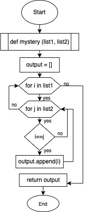

# Quiz 33
*Test code given*

## Code
```.py
def mystery(list1, list2):
    output=[]
    for i in list1:
        for j in list2:
            if i==j:
                output.append(i)
    return output
```

## Flowchart


## Output

