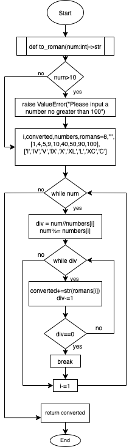

# Quiz 34
*Test Code given*

## Code
**Python**
```.py
def to_roman(num:int)->str:
    if num>100:
        raise ValueError("Please input a number no greater than 100")
    i,converted,numbers,romans=8,"",[1,4,5,9,10,40,50,90,100],['I','IV','V','IX','X','XL','L','XC','C']
   
    while num:
        div=num//numbers[i]
        num %= numbers[i]

        while div:
            converted+=str(romans[i])
            div-=1
            if div==0:
                break
        i-=1
    return converted
```
**Test Code** - *test_quiz_34.py*
```pycon
from q34 import to_roman
import pytest

def test_to_roman():
    assert to_roman(1) == 'I'
    assert to_roman(4) == 'IV'
    assert to_roman(9) == 'IX'
    assert to_roman(37) == 'XXXVII'
    assert to_roman(44) == 'XLIV'
    assert to_roman(50) == 'L'
    assert to_roman(99) == 'XCIX'
    assert to_roman(100) == 'C'
    assert to_roman(77) == 'LXXVII'
    assert to_roman(93) == 'XCIII'


def test_to_roman_exceptions():
    # check that the program raises a ValueError
    with pytest.raises(ValueError):
        to_roman(101)
```
## Flowchart


## Output

