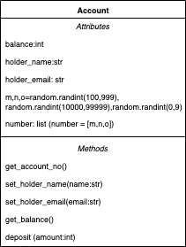
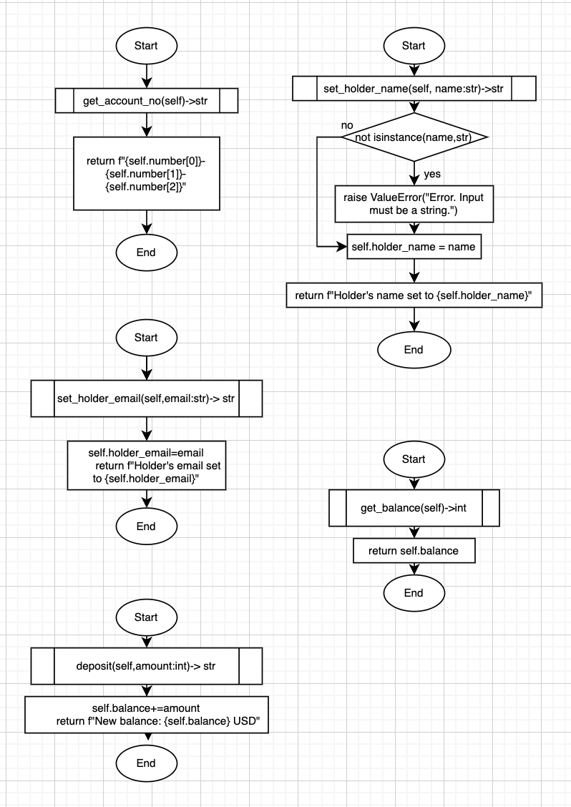

# Quiz 35
*Test Code given*

## Code
```.py
import random
class Account:
    def __init__(self):
        self.balance=0
        self.holder_name=""
        self.holder_email=""
        m,n,o=random.randint(100,999),random.randint(10000,99999),random.randint(0,9)
        self.number = [m,n,o]

    def get_account_no(self)->str:
        return f"{self.number[0]}-{self.number[1]}-{self.number[2]}"

    def set_holder_name(self,name:str)->str:
        if not isinstance(name,str):
            raise ValueError("Error. Input must be a string.")
        self.holder_name=name
        return f"Holder's name set to {self.holder_name}"

    def set_holder_email(self,email:str)->str:
        self.holder_email=email
        return f"Holder's email set to {self.holder_email}"

    def get_balance(self)->int:
        return self.balance

    def deposit(self,amount:int)->str:
        self.balance+=amount
        return f"New balance: {self.balance} USD"
```

**Test Code**
```pycon
import pytest
from q35 import Account

def test_empty_account():
    bk = Account()
    assert bk.balance == 0
    assert bk.holder_name == ""
    assert bk.holder_email == ""
    assert isinstance(bk.number, list)
    number = bk.get_account_no().split("-")
    assert  len(number)==3 and len(number[0])==3 and len(number[1])==5 and len(number[2])==1

def test_create_account():
    bk = Account()
    assert bk.get_balance() == 0
    assert bk.set_holder_name(name="Bob") == "Holder's name set to Bob"
    assert bk.set_holder_email(email="bob@company.xyz") == "Holder's email set to bob@company.xyz"
    assert bk.deposit(amount=100) == "New balance: 100 USD"
    assert bk.get_balance() == 100


def test_value_errors():
    bk = Account()
    with pytest.raises(ValueError):
        bk.set_holder_email(email="bob@bob@bob")
        bk.set_holder_name(name=["Bob"])
        bk.set_holder_name(name=100)
```

## Output


## UML Diagram


## Flowcharts


