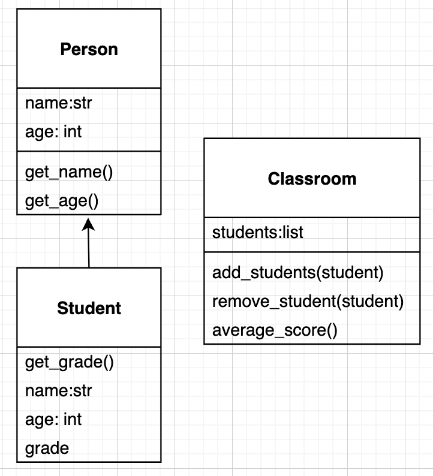
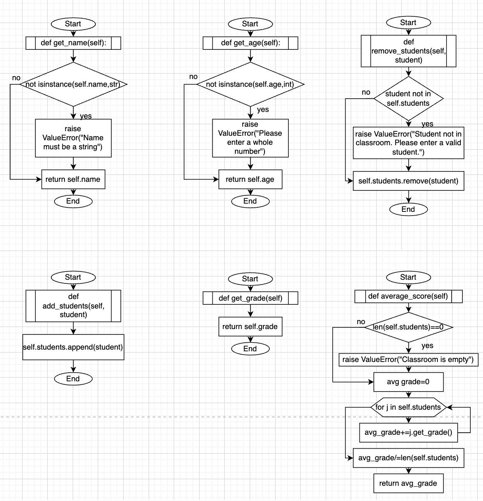
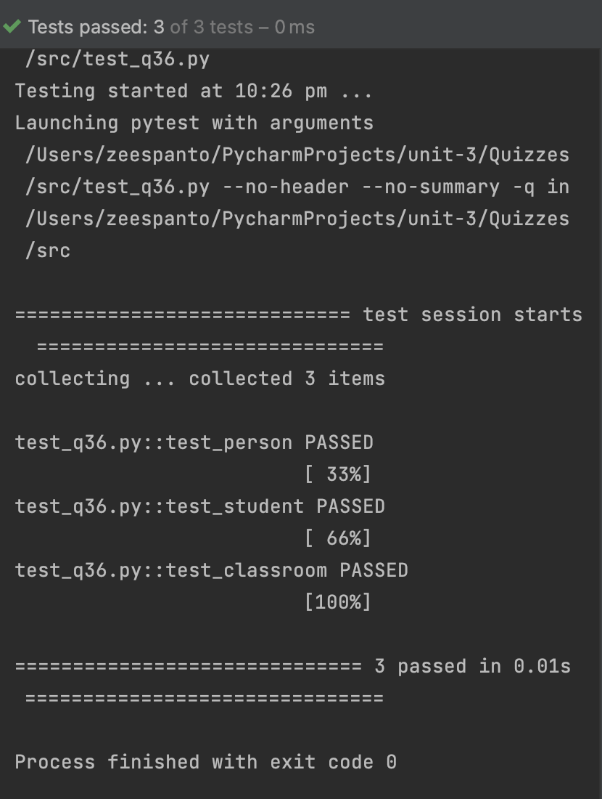

# Quiz 36

## Code
**Classes** - *q36.py* 
```pycon
class Person:
    def __init__(self,name:str,age:int):
        self.name=name
        self.age=age
    def get_name(self):
        if not isinstance(self.name,str):
            raise ValueError("Name must be a string")
        return self.name
    def get_age(self):
        if not isinstance(self.age, int):
            raise ValueError("Please enter a whole number")
        return self.age

class Student(Person):
    def __init__(self,name,age,grade):
        super().__init__(name,age)
        self.grade=grade
        self.name=name
        self.age=age
    def get_grade(self):
        return self.grade

class Classroom:
    def __init__(self):
        self.students=[]

    def add_students(self,student):
        self.students.append(student)

    def remove_students(self,student):
        if student not in self.students:
            raise ValueError("Student not in classroom. Please enter a valid student.")
        self.students.remove(student)

    def average_score(self):
        if len(self.students)==0:
            raise ValueError("Classroom is empty")
        avg_grade=0
        for j in self.students:
            avg_grade+=j.get_grade()
        avg_grade/=len(self.students)
        return avg_grade
```

**Python Test File**
```pycon
import pytest
from q36 import Student,Classroom,Person

def test_person():
    p1=Person("Antonia",16)
    assert p1.get_name()=="Antonia"
    assert p1.get_age()==16
    with pytest.raises(ValueError):
        p2 = Person(17,"Zelan")
        p2.get_age()
        p2.get_name()
def test_student():
    student=Student("Sahana",17,85)
    assert student.get_grade() == 85
    assert student.get_name() == "Sahana"
    assert student.get_age() == 17
    with pytest.raises(ValueError):
        student = Student(["Yasmina"],17,90)
        student.get_name()

def test_classroom():
    c = Classroom()
    s1 = Student("Mayte", 17,95)
    s2 = Student("Lemie", 17, 84)
    s3 = Student("Sana", 17, 87)
    c.add_students(s1)
    c.add_students(s2)
    c.add_students(s3)
    c.remove_students(s2)
    assert c.average_score() == 91
    c.remove_students(s1)
    c.remove_students(s3)
    with pytest.raises(ValueError):
        c.average_score()
```

## UML Diagram

Fig. 1 UML Diagram of the classes in q36.py

## Flowcharts

Fig 2. Flowcharts of the different methods of the classes in q36.py

## Evidence
