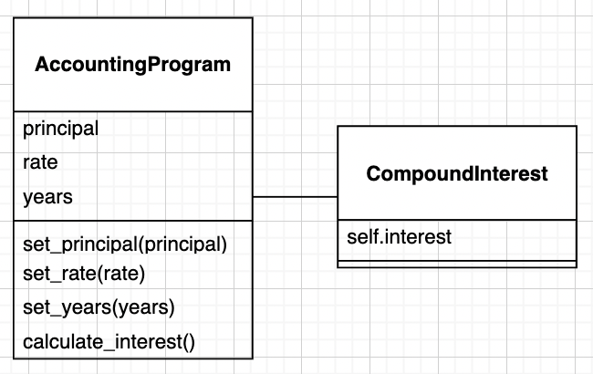
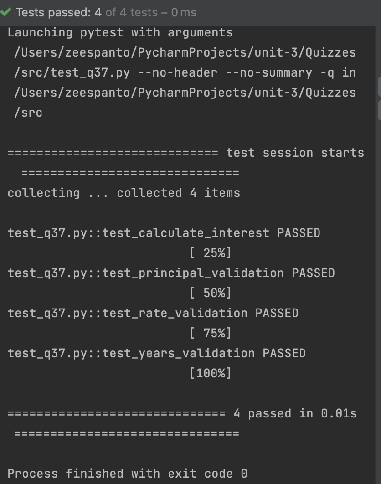

# Quiz 37

! Modify Q37 to follow instructions

## Code
```pycon
class CompoundInterest:
    def __init__(self,principal,rate,num_years):
        self.principal=principal
        self.rate=rate
        self.numyears=num_years

    def calculate_interest(self):
        interest=round(self.principal*(1+self.rate)**self.numyears, 2)
        return interest

class AccountingProgram(CompoundInterest):
    def __init__(self):
        self.compound=CompoundInterest(0,0,0)

    def set_principal(self,principal):
        if principal<0:
            raise ValueError("Principal should be greater than zero")
        else:
            self.compound.principal=principal

    def set_rate(self,rate:int):
        if rate<0:
            raise ValueError("Interest rate should be greater than zero")
        else:
            self.compound.rate=rate

    def set_years(self,years:int):
        if years<0:
            raise ValueError("Years should be greater than zero")
        else:
            self.compound.numyears=years

    def calculate_interest(self):
        return self.compound.calculate_interest()
```

## Test Code
```.py
import pytest
from q37 import AccountingProgram

def test_calculate_interest():
    program = AccountingProgram()
    program.set_principal(1000)
    program.set_rate(0.05)
    program.set_years(10)
    interest = program.calculate_interest()
    assert interest == 1628.89

def test_principal_validation():
    program = AccountingProgram()
    with pytest.raises(ValueError) as err:
        program.set_principal(-1000)
    assert "Principal should be greater than zero" in str(err.value)

def test_rate_validation():
    program = AccountingProgram()
    with pytest.raises(ValueError) as err:
        program.set_rate(-0.05)
    assert "Interest rate should be greater than zero" in str(err.value)

def test_years_validation():
    program = AccountingProgram()
    with pytest.raises(ValueError) as err:
        program.set_years(-10)
    assert "Years should be greater than zero" in str(err.value)
```

## UML Diagram


## Evidence
