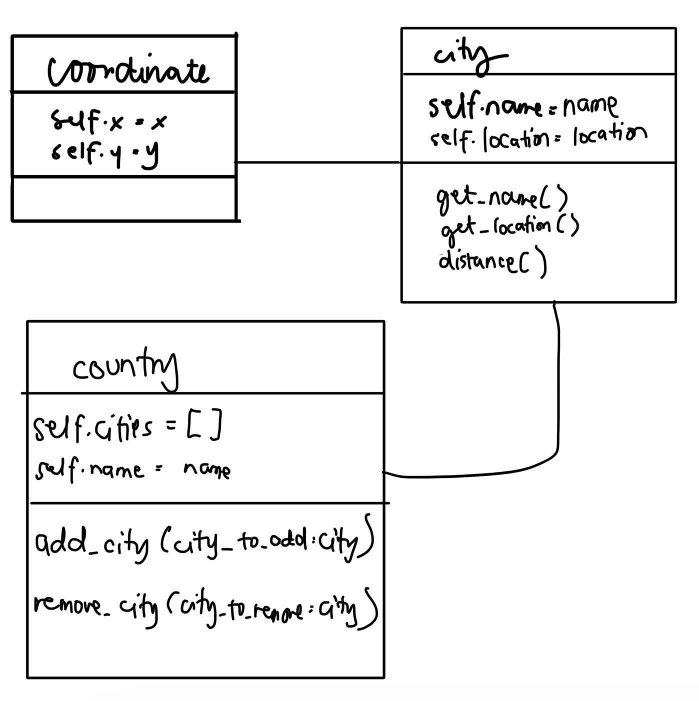
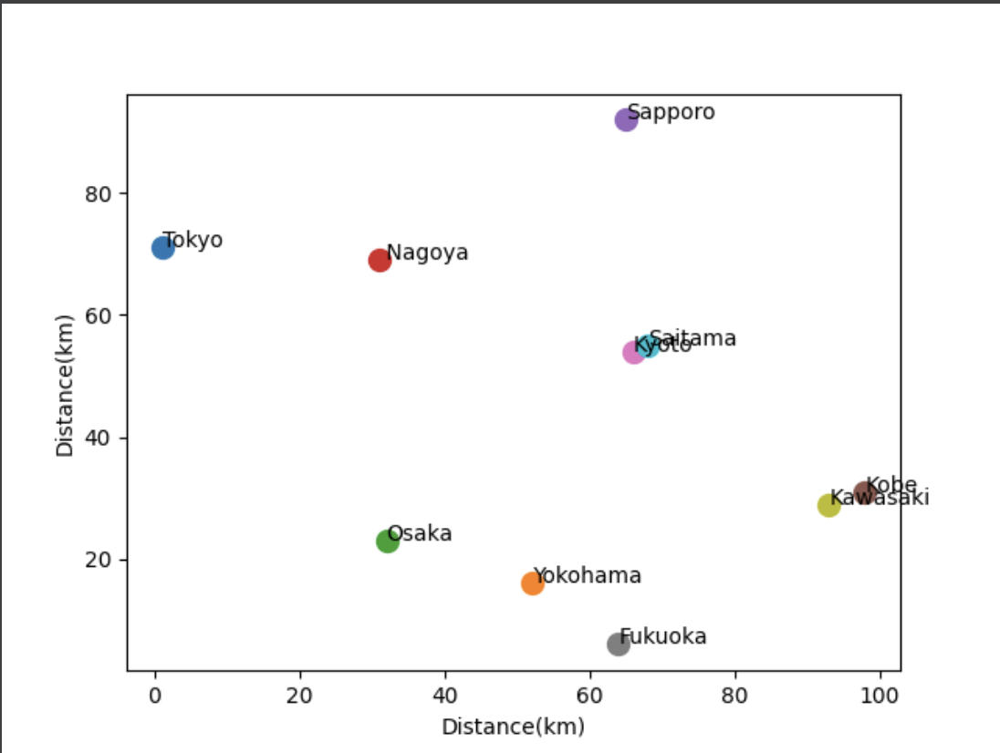

# Quiz 38

## Code
```pycon
import random
from matplotlib import pyplot as plt
from Lessons.main import city, coordinate,country

jp_cities=['Tokyo','Yokohama','Osaka',' Nagoya','Sapporo','Kobe','Kyoto','Fukuoka','Kawasaki','Saitama']

japan = country(name="Japan")
for ct in jp_cities:
    x_rand = random.randint(0,100)
    y_rand = random.randint(0,100)
    ct = city(name=ct,location=coordinate(x_rand,y_rand))
    japan.add_city(city_to_add=ct)

for i in japan.cities:
    x=i.location.x
    y=i.location.y
    plt.text(x,y,i.name)
    plt.scatter(x,y,s=100)
plt.xlabel("Distance(km)")
plt.ylabel("Distance(km)")
plt.savefig('q38.png')
plt.show()
```


```pycon
class coordinate:
    def __init__(self, x, y):
        self.x = x
        self.y = y

    def __repr__(self) -> str:
        return f"[Coordinate Object]: x={self.x} y={self.y}"

class city:
    def __init__(self, name:str, location:coordinate):
        self.name = name
        self.location = location

    def __repr__(self) -> str:
        return f"[City Object] {self.name} located at {self.location}"

    def get_name(self):
        return self.name

    def get_location(self,CityB):
         self.location.x

    def distance(self, cityB):
        xa,ya = self.location.x, self.location.y
        xb,yb = cityB.location.x, cityB.location.y
        d=((xa-xb)**2 +(ya-yb)**2)**(1/2)
        return round(d,2)


class country:
    def __init__(self, name) -> None:
        self.cities = []
        self.name = name

    def __repr__(self) -> str:
        return f"[Country Class] {self.name} with cities: {self.cities}"

    def add_city(self, city_to_add:city):
        if isinstance(city_to_add, city):
            self.cities.append(city_to_add)
        else:
            raise ValueError("City must be a City Object")

    def remove_city(self, city_to_remove:city):
        self.cities = [value for value in self.students if value != city_to_remove]

```
## UML Diagram

## Output

