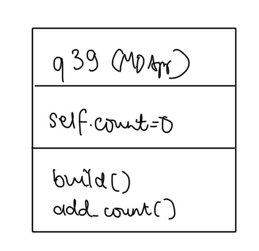
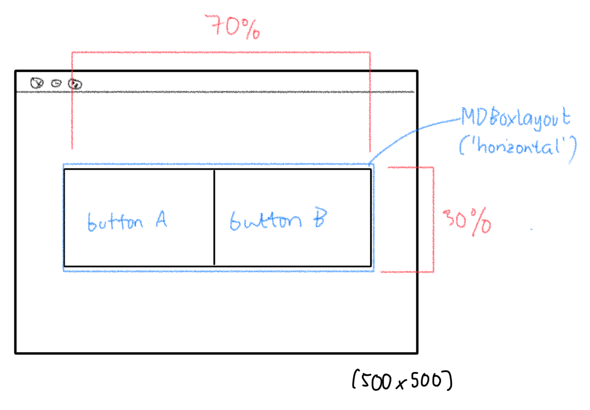
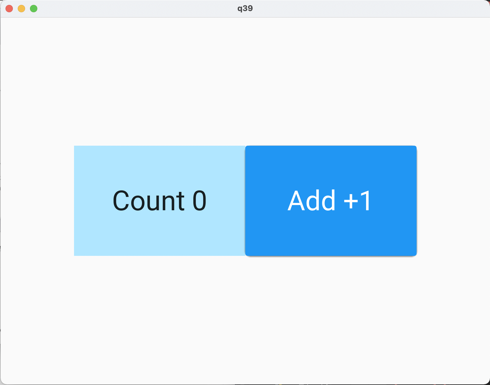
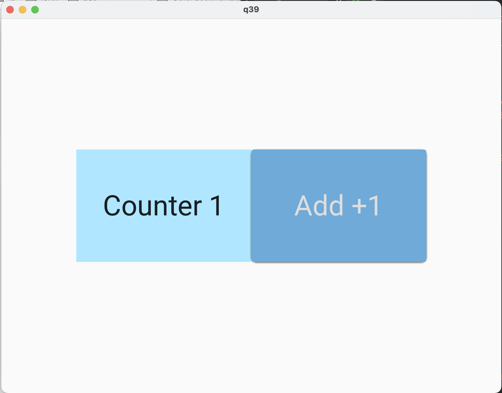

# Quiz 39

## Code
**Python**
```pycon
from kivymd.app import MDApp

class q39(MDApp):
    def __init__(self,**kwargs):
        super().__init__(**kwargs)
        self.count = 0

    def build(self):
        return
    def add_count(self):
        self.count +=1
        self.root.ids.counter.text = f"Counter {self.count}"


test = q39()
test.run()


```

**Kivy**
```pycon
Screen:
    size: 500,500

    MDBoxLayout:
        orientation: "horizontal"
        alignment: "horizontal"
        pos_hint:{"center_x":.5, "center_y":.5}
        size_hint: .7,.3
        md_bg_color: "#f2f4f5"

        MDLabel:
            halign: "center"
            valign: "center"
            id: counter
            text: "Count 0"
            size_hint:.5,1
            font_size: "34pt"
            md_bg_color: "#b0e6ff"

        MDRaisedButton:
            size_hint: .5, 1
            font_size: "34pt"
            text: "Add +1"
            on_release:
                app.add_count()

```

## UML Diagram


## Wireframe


## Output

