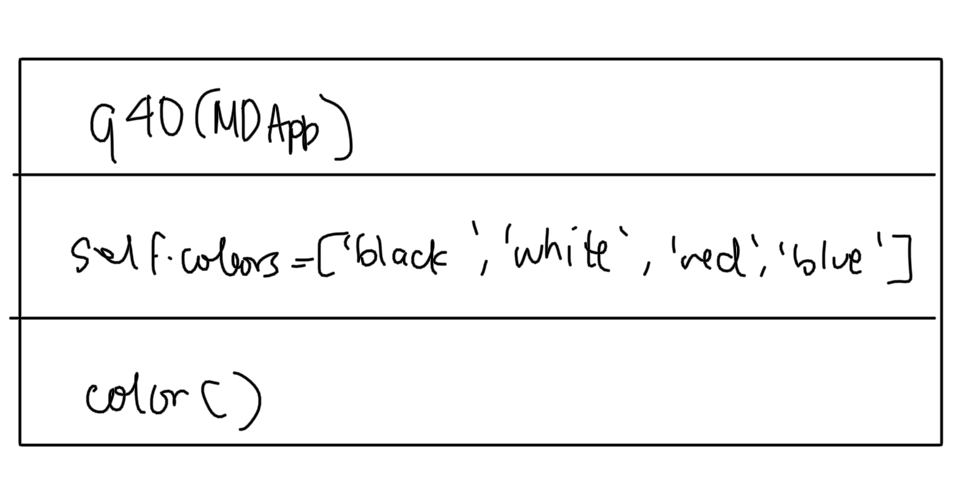
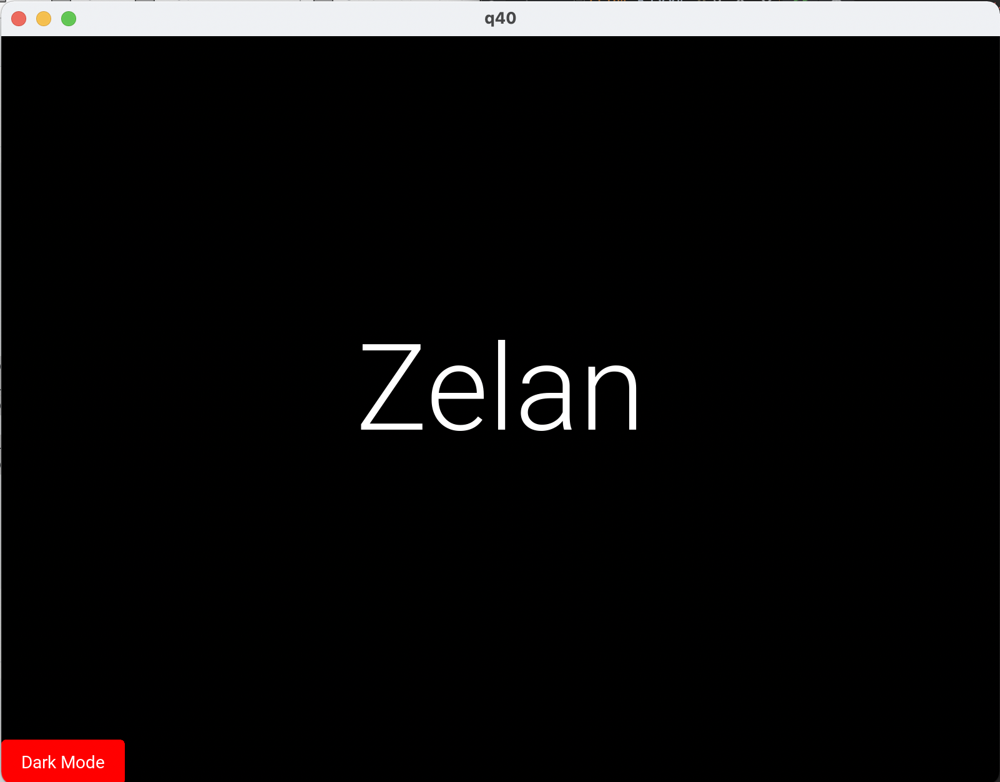

# Quiz 40

## Code
**Python**
```pycon
from kivymd.app import MDApp
import warnings
warnings.simplefilter('ignore')

class q40(MDApp):
    def __init__(self, **kwargs):
        super().__init__(**kwargs)
        self.colors = ["black","white","red","blue"]
    def build(self):
        return
    def color(self):
        if self.root.ids.main1.md_bg_color == self.colors[1]:
            self.root.ids.main1.md_bg_color = self.colors[0]
            self.root.ids.btn1.md_bg_color = self.colors[2]
            self.root.ids.txt.text_color = self.colors[1]
        else:
            self.root.ids.main1.md_bg_color = self.colors[1]
            self.root.ids.btn1.md_bg_color = self.colors[3]
            self.root.ids.txt.text_color = self.colors[0]

test = q40()
test.run()
```

**Kivy**
```.kv
Screen:
    MDBoxLayout:
        id:main1
        pos_hint:{"center_x":0.5, "center_y":0.5}
        size_hint:1,1
        md_bg_color: "white"
        orientation: "vertical"

        MDLabel:
            id:txt
            text: "Zelan"
            text_color: "black"
            theme_text_color: "Custom"
            halign: "center"
            font_style: "H1"

        MDRaisedButton:
            id:btn1
            text: "Dark Mode"
            pos_hint: {"corner_x":.5}
            md_bg_color: "blue"
            text_color: "white"
            on_release: app.color()
```

## UML Diagram


## Wireframe


## Output



