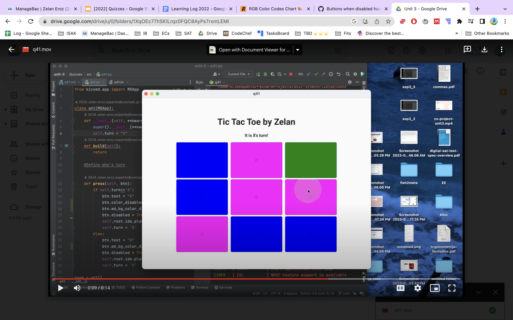
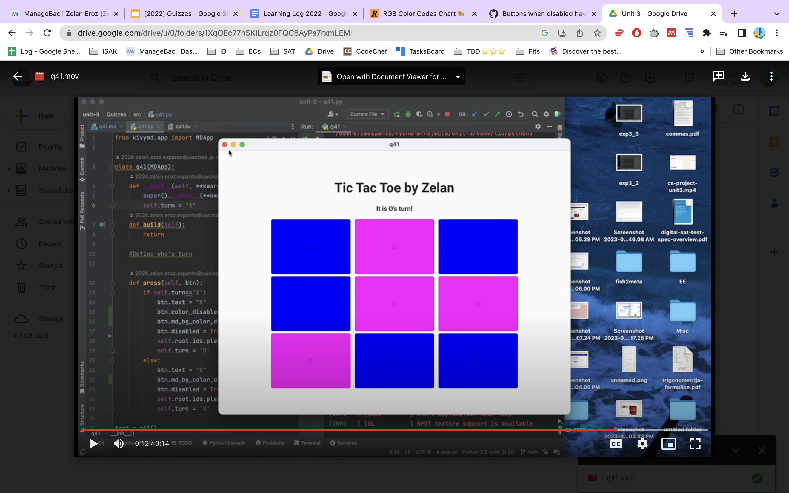

# Quiz 41

## Code
**Kivy**
```.kv
Screen:
    size: 500,500

    MDBoxLayout:
        orientation: "vertical"
        pos_hint: {"center_x": 0.5,"center_y":0.5}
        size_hint: .7, .8

        MDLabel:
            size_hint: 1, .1
            halign: "center"
            text: "Tic Tac Toe by Zelan"
            font_size: "60px"
            bold: True

        MDLabel:
            id: player
            size_hint: 1, .1
            halign: "center"
            text: "It is X's turn"
            font_size: "30px"
            bold: True

        MDBoxLayout:
            size_hint: 1,.8
            orientation: "vertical"
            spacing: 10
            MDBoxLayout:
                orientation: "horizontal"
                spacing: 20
                MDRectangleFlatButton:
                    id: btn1
                    text: ""
                    text_color: "white"
                    md_bg_color: "green"
                    size_hint: .3,1
                    on_release:
                        app.press(btn1)
                MDRectangleFlatButton:
                    id: btn2
                    text: ""
                    text_color: "white"
                    md_bg_color: "green"
                    size_hint:.3,1
                    on_release:
                        app.press(btn2)
                MDRectangleFlatButton:
                    id: btn3
                    text: ""
                    text_color: "white"
                    md_bg_color: "green"
                    size_hint:.3,1
                    on_release:
                        app.press(btn3)
            MDBoxLayout:
                orientation: "horizontal"
                spacing: 20
                MDRectangleFlatButton:
                    id: btn4
                    text: ""
                    text_color: "white"
                    md_bg_color: "green"
                    size_hint: .3,1
                    on_release:
                        app.press(btn4)
                MDRectangleFlatButton:
                    id: btn5
                    text: ""
                    text_color: "white"
                    md_bg_color: "green"
                    size_hint:.3,1
                    on_release:
                        app.press(btn5)
                MDRectangleFlatButton:
                    id: btn6
                    text: ""
                    text_color: "white"
                    md_bg_color: "green"
                    size_hint:.3,1
                    on_release:
                        app.press(btn6)
            MDBoxLayout:
                orientation: "horizontal"
                spacing: 20
                MDRectangleFlatButton:
                    id: btn7
                    text: ""
                    text_color: "white"
                    md_bg_color: "green"
                    size_hint: .3,1
                    on_release:
                        app.press(btn7)
                MDRectangleFlatButton:
                    id: btn8
                    text: ""
                    text_color: "white"
                    md_bg_color: "green"
                    size_hint:.3,1
                    on_release:
                        app.press(btn8)
                MDRectangleFlatButton:
                    id: btn9
                    text: ""
                    text_color: "white"
                    md_bg_color: "green"
                    size_hint:.3,1
                    on_release:
                        app.press(btn9)
```

**Python**
```pycon
from kivymd.app import MDApp

class q41(MDApp):
    def __init__(self, **kwargs):
        super().__init__(**kwargs)
        self.turn = "X"
    def build(self):
        return

    #Define who's turn

    def press(self, btn):
        if self.turn=='X':
            btn.text = "X"
            btn.color_disabled=(252, 186, 3)
            btn.md_bg_color_disabled= [0, 0, 102, 100]
            btn.disabled = True
            self.root.ids.player.text = "It is O's turn!"
            self.turn = 'O'
        else:
            btn.text = "O"
            btn.md_bg_color_disabled= [102, 0, 102, 100]
            btn.disabled = True
            self.root.ids.player.text = "It is X's turn!"
            self.turn = 'X'

test = q41()
test.run()
```


## Output

[Video](https://drive.google.com/drive/u/0/folders/1XqOEc77hSKlLrqz0FQC8AyPs7rxmLEMl)


