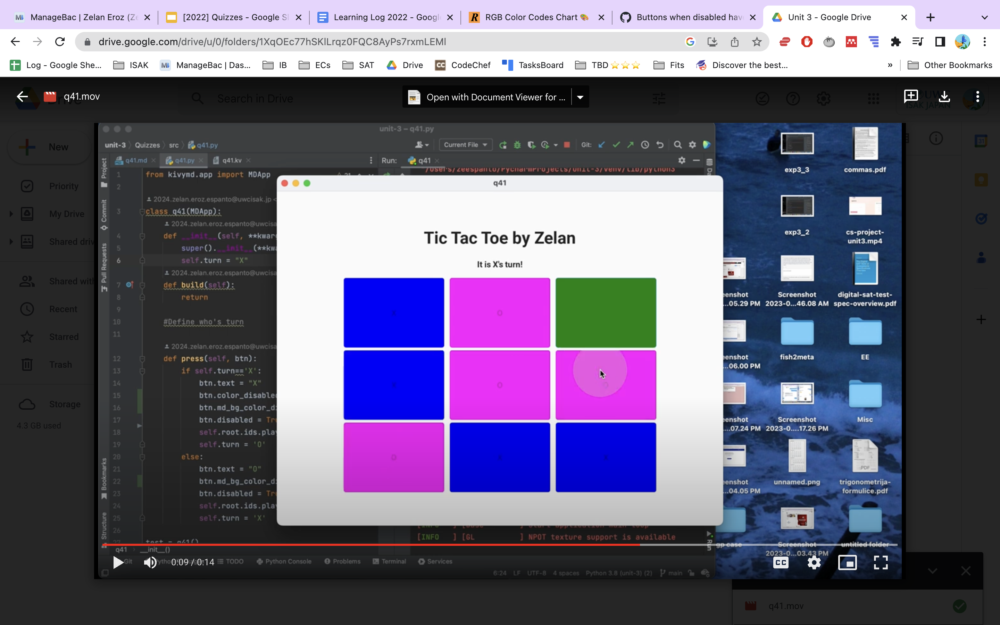

# Quiz 42

## Code
**Python** - *q42.py*
```pycon
from kivymd.app import MDApp
from kivymd.uix.screen import MDScreen

class MysteryPageA(MDScreen):
    def message1(self):
        self.ids.texta.text = "This is mystery page A you pressed the button"

class MysteryPageB(MDScreen):
    def message2(self):
        self.ids.textb.text = "This is mystery page B you pressed the button"

class Mystery(MDApp):
    def build(self):
        return

test = Mystery()
test.run()
```
**Kivy** - *mystery.kv*
```pycon
ScreenManager:
    MysteryPageA:
        name: "MysteryPageA"
    MysteryPageB:
        name: "MysteryPageB"

<MysteryPageA>:
    MDBoxLayout:
        orientation: "vertical"
        size_hint: .8,.8
        pos_hint: {"center_x":.5, "center_y":.5}
        MDLabel:
            id: texta
            text: ""
            font_size: "50px"
            halign:"center"
            valign: "center"
            bold: True
        MDBoxLayout:
            orientation: "horizontal"
            MDRaisedButton:
                text: "Press me"
                on_press:
                    root.message1()
            MDRaisedButton:
                text: "Next Page"
                on_press: 
                    root.parent.current="MysteryPageB"

<MysteryPageB>:
    MDBoxLayout:
        orientation: "vertical"
        size_hint: .8,.8
        pos_hint: {"center_x":.5, "center_y":.5}
        MDLabel:
            id: textb
            text: ""
            font_size: "50px"
            halign:"center"
            valign: "center"
            bold: True
        MDBoxLayout:
            orientation: "horizontal"
            MDRaisedButton:
                text: "Press me"
                on_press:
                    root.message2()
            MDRaisedButton:
                text: "Next Page"
                    root.parent.current="MysteryPageA"
```
## Output



