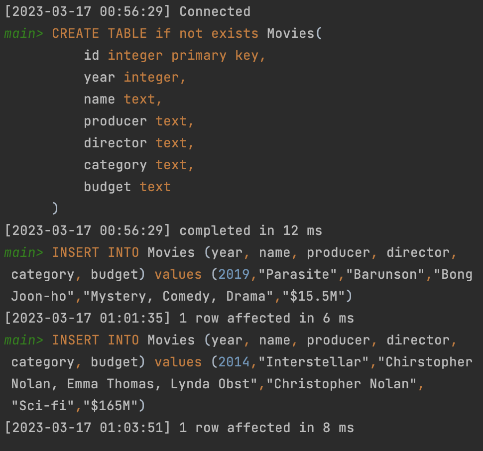

# Quiz 43

## SQL Console
```sqlite
CREATE TABLE if not exists Movies(
    id integer primary key,
    year integer,
    name text,
    producer text,
    director text,
    category text,
    budget text
);

INSERT INTO Movies (year, name, producer, director, category, budget) values (2019,"Parasite","Barunson","Bong Joon-ho","Mystery, Comedy, Drama","$15.5M");
INSERT INTO Movies (year, name, producer, director, category, budget) values (2014,"Interstellar","Chirstopher Nolan, Emma Thomas, Lynda Obst","Christopher Nolan","Sci-fi","$165M");
```

## Output
