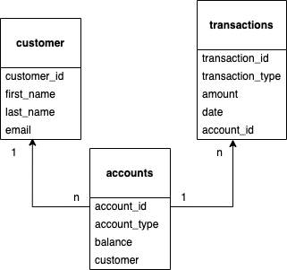

# Quiz 45

## 1. UML Diagram


## 2. Find the culprit through SQL queries.
```sqlite
SELECT
  CASE
    WHEN total_deposit - total_withdraw != balance THEN 'bad'
    ELSE 'good'
  END AS 'Status',
  total_deposit,
  total_withdraw,
  balance,
  account_id
FROM (
  SELECT
    SUM(amount) AS total_deposit,
    account_id AS a_d
  FROM transactions
  WHERE transaction_type = 'deposit'
  GROUP BY account_id
),
(
  SELECT
    SUM(amount) AS total_withdraw,
    account_id AS a_w
  FROM transactions
  WHERE transaction_type = 'withdraw'
  GROUP BY account_id
),
accounts
WHERE a_d = a_w
  AND a_d = accounts.account_id;
```

## 3. Culprit Info
**What is the name of the customer and the problem that resulted in the bankruptcy of the bank?**

```sqlite
SELECT customers.first_name, customers.last_name, accounts.account_id
FROM customers
JOIN accounts
ON customers.customer_id = accounts.customer_id
WHERE accounts.account_id IN (12, 13, 15, 17, 19);
```

* Matthew Martin with account id of 12
* Ashley Taylor with account id of 13
* Nicholas Lewis with account id of 15
* David Clark with account id of 17
* Daniel Green with account id of 19