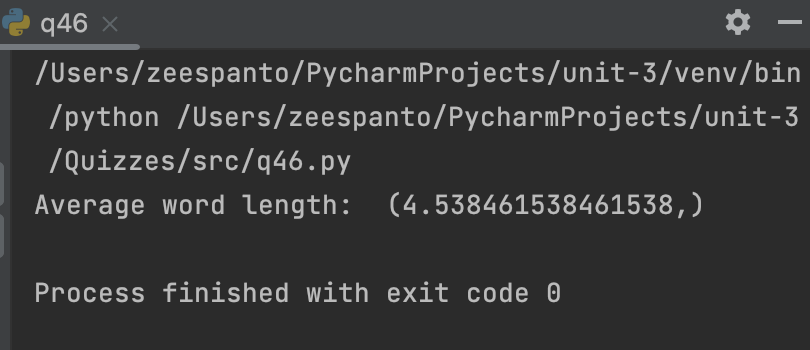
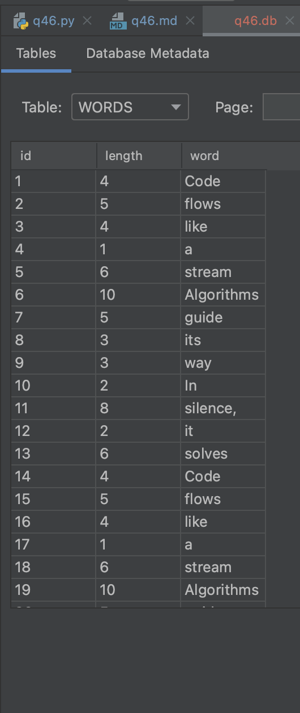

# Quiz 46

## Code

**Python**
```pycon
import sqlite3
haiku="""Code flows like a stream
Algorithms guide its way
In silence, it solves"""
connection = sqlite3.connect("q46.db")
cursor = connection.cursor()

#Create database with table Words
query = f"""CREATE TABLE if not exists WORDS(
        id integer primary key autoincrement,
        length integer not null,
        word text not null 
    )"""
cursor.execute(query)

for word in haiku.split():
    query2 = f"insert into WORDS(word, length) VALUES ('{word}',{len(word)})"
    cursor.execute(query2)
    connection.commit()
#query the average of all the lengths
avg = cursor.execute("SELECT avg(length) from WORDS").fetchone()
connection.commit()
print("Average word length: ", avg)
connection.close()
```


## Output


