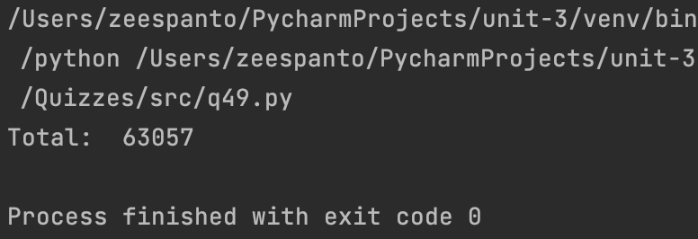

# Quiz 49

## Code
```pycon
import sqlite3
from secure_password import check_password

connection = sqlite3.connect("bitcoin_exchange.db")
cursor = connection.cursor()
query = "SELECT * FROM ledger"
result = cursor.execute(query).fetchall()
connection.close()
blank=0
for i in result:
    unhashed = f"id {i[0]},sender_id {i[1]},receiver_id {i[2]},amount {i[3]}"
    if check_password(user_password=unhashed, hashed_password=i[4])==True:
        blank+=i[3]

print('Total: ', blank)
```

## Flowchart

## Output
