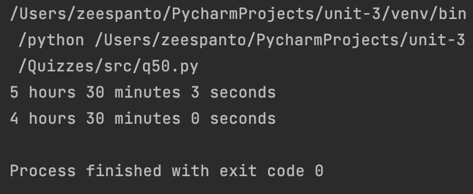

# Quiz 50

## Code

```pycon
class Flight:
    def __init__(self, fn:str, origin:str,destination:str,dpt_time:str,duration:list):
        self.flight_number=fn
        self.origin = origin
        self.destination = destination
        self.departure_time = dpt_time
        self.duration = duration

    def get_duration(self):
        return f"{self.duration[0]} hours {self.duration[1]} minutes {self.duration[2]} seconds"

test1 = Flight("AA123","New York","Los Angeles","10:00AM",[5,30,3])
print(test1.get_duration())

test2 = Flight("Z2191","Tokyo","Manila","11:10AM",[4,30,0])
print(test2.get_duration())
```

## Output
