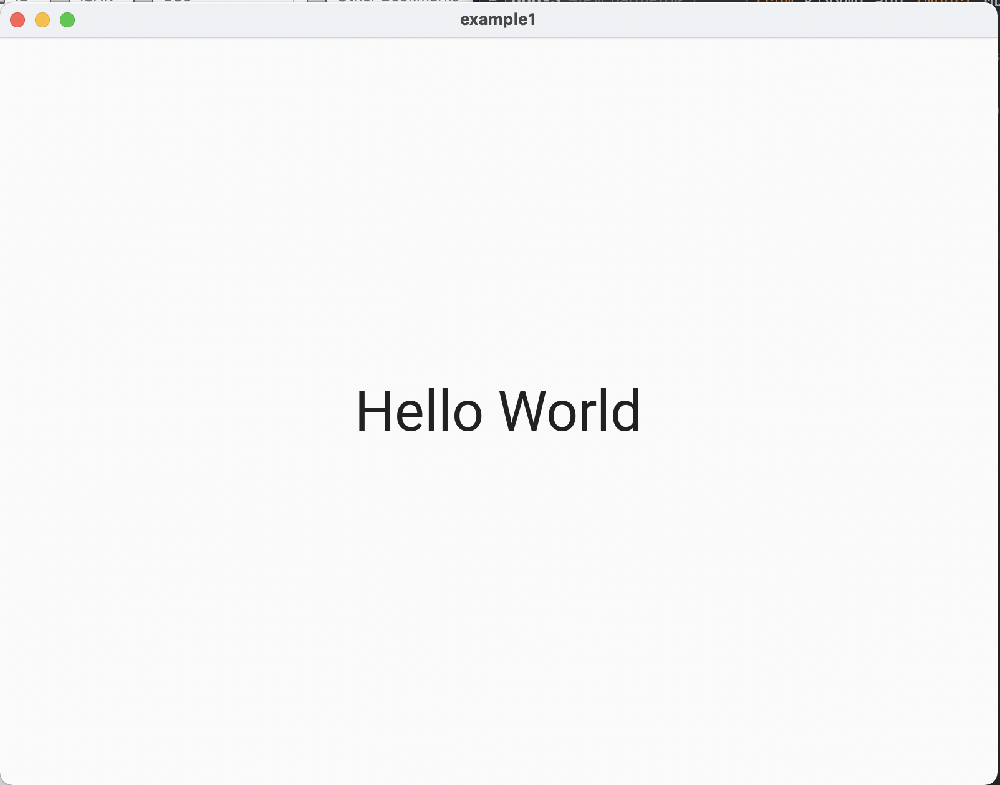
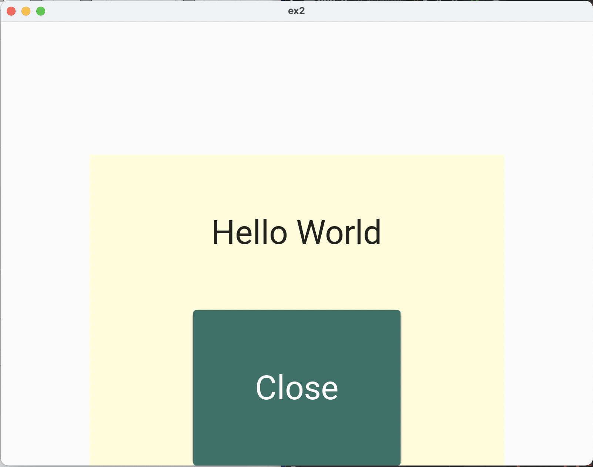
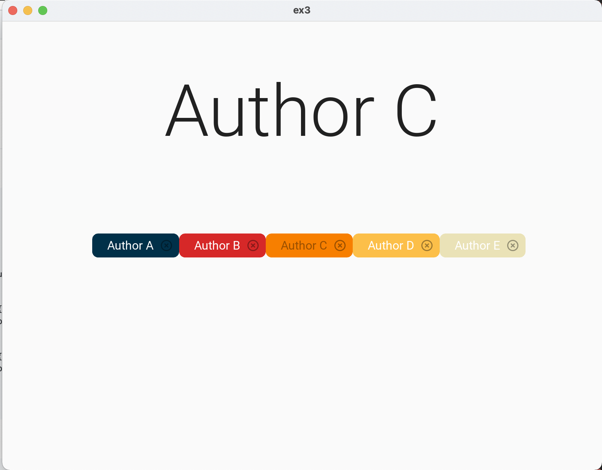
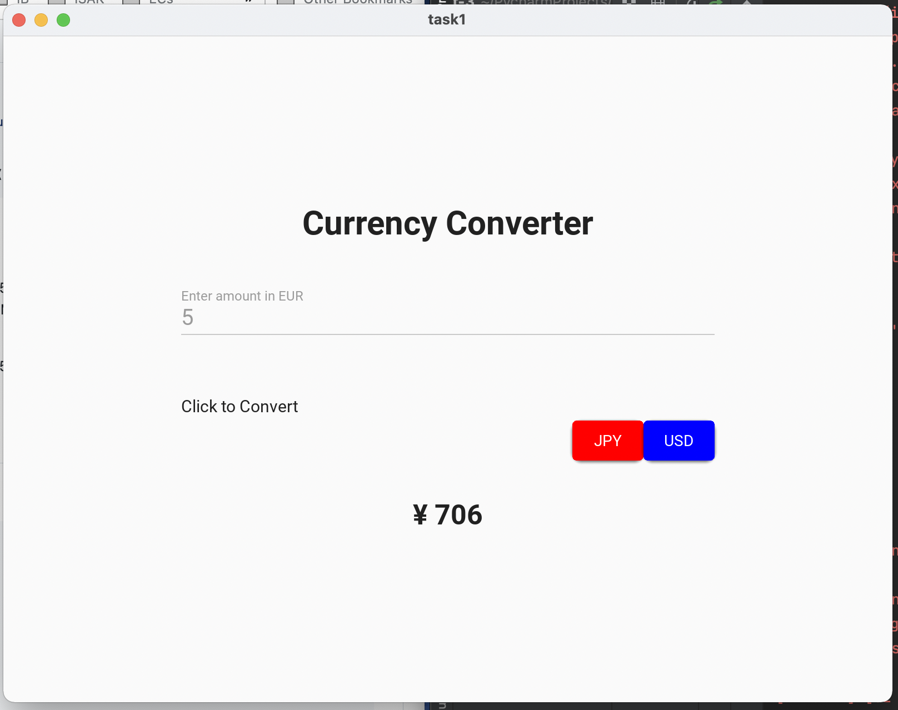
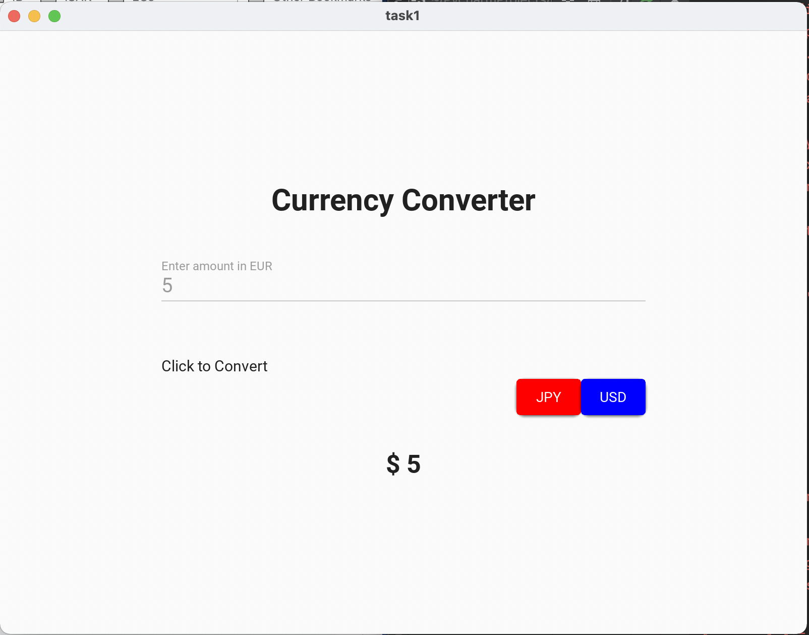
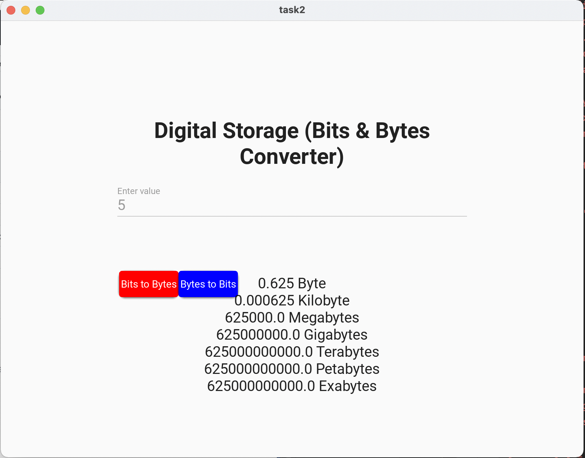
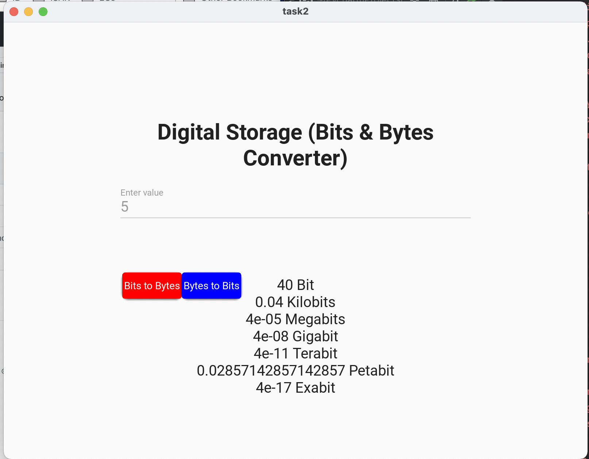

# Example 1 <a name="ex1"></a>
### **Python**
```.py
from kivymd.app import MDApp

class example1(MDApp):
    def build(self):
        return

test = example1()
test.run()
```
### **Kivy**
```.kv
Screen:
    size: 500,500

    MDLabel:
        text:"Hello World"
        halign: "center"
        font_size: "34pt"
```
### Output


# Example 2 <a name="ex2"></a>
### **Python**
```pycon
from kivymd.app import MDApp

class ex2(MDApp):
    def build(self):
        return
    def close(self):
        exit()

test = ex2()
test.run()
```

### **Kivy**
```.kv
Screen:
    size: 500,500

    MDBoxLayout:
        pos_hint: {"center_x":.5}
        size_hint: .7,.7
        md_bg_color: "#fdfcdc"
        orientation: "vertical"

        MDLabel:
            text:"Hello World"
            halign: "center"
            font_size: "34pt"

        MDRaisedButton:
            text: "Close"
            size_hint: .5,1
            font_size: "34pt"
            pos_hint: {"center_x":.5}
            md_bg_color: "#407167"
            on_press:
                app.close()
```

### **Output**


# Example 3 <a name="ex3"></a>
### **Python**
```pycon
from kivymd.app import MDApp

class ex3(MDApp):
    def build(self):
        return

    def change_author(self,name):
        self.root.ids.text.text = f"Author {name}"

test = ex3()
test.run()
```

### **Kivy**
```.kv
Screen:
    size: 500,500

    MDLabel:
        id: text
        text: "Slay"
        font_style: "H1"
        pos_hint: {"center_x":.5, "center_y":.8}
        halign: "center"
        valign: "top"
        text_color: "#000000"
    MDBoxLayout:
        pos_hint: {"center_x":.5,"center_y":.5}
        size_hint: .7,.2
        orientation: "horizontal"

        MDChip:
            text: "Author A"
            pos_hint: {"center_y":.5}
            icon_right: "close-circle-outline"
            md_bg_color: "#003049"
            text_color: "#FFFFFF"
            on_press: app.change_author("A")
        MDChip:
            text: "Author B"
            pos_hint: {"center_y":.5}
            icon_right: "close-circle-outline"
            md_bg_color: "#D62828"
            text_color: "#FFFFFF"
            on_press: app.change_author("B")
        MDChip:
            text: "Author C"
            pos_hint: {"center_y":.5}
            icon_right: "close-circle-outline"
            md_bg_color: "#F77F00"
            on_press: app.change_author("C")
        MDChip:
            text: "Author D"
            pos_hint: {"center_y":.5}
            icon_right: "close-circle-outline"
            md_bg_color: "#FCBF49"
            text_color: "#FFFFFF"
            on_press: app.change_author("D")
        MDChip:
            text: "Author E"
            pos_hint: {"center_y":.5}
            icon_right: "close-circle-outline"
            md_bg_color: "#EAE2B7"
            text_color: "#FFFFFF"
            on_press: app.change_author("E")
```

### **Output**



# Task 1 <a name="task_1"></a>
### **Python**
```pycon
from kivymd.app import MDApp
class task1(MDApp):
    def __init__(self,**kwargs):
        super().__init__(**kwargs)
        self.converted=0
        self.amount=0
        self.type="eur"
    def build(self):
        return
    def set_input(self):
        input = self.root.ids.user_input.text
        if input.isnumeric()==False:
            self.root.ids.output.text = "Please enter an integer"
        else:
            self.amount = int(input)
    def to_jpy(self):
        converted=0
        converted = round(self.amount*141.16)
        self.root.ids.output.text = f"¥ {converted}"
        
    def to_usd(self):
        converted=0
        converted = round(self.amount*1.08)
        self.root.ids.output.text = f"$ {converted}"

test=task1()
test.run()
```

### **Kivy**
```.kv
Screen:
    size: 500,500

    MDBoxLayout:
        pos_hint:{"center_x":.5,"center_y":.5}
        size_hint: .6,.6
        orientation: "vertical"
        MDLabel:
            text: "Currency Converter"
            font_size: "60"
            halign: "center"
            bold: True
        MDTextField:
            id: user_input
            hint_text: "Enter amount in EUR"
            font_size: 40
            on_text:
                app.set_input()
        MDBoxLayout:
            pos_hint:{"center_x":.5}
            orientation: "horizontal"
            MDLabel:
                text:"Click to Convert"
                font_size: "30px"
                text_color: "grey"
            MDRaisedButton:
                md_bg_color: "red"
                text: "JPY"
                on_release:
                    app.to_jpy()
            MDRaisedButton:
                text: "USD"
                md_bg_color: "blue"
                on_release:
                    app.to_usd()
        MDLabel:
            id: output 
            text: ""
            halign:"center"
            bold:True
```

### **Output**





# Task 2 <a name="task_2"></a>
### Python
```pycon
from kivymd.app import MDApp
class task2(MDApp):
    def build(self):
        return

    def set_input(self):
        self.value = int(self.root.ids.user_input.text)

    def to_bits(self):
        output = f"{self.value*8} Bit\n{self.value/125} Kilobits\n{self.value/125000} Megabits\n{self.value/125000000} Gigabit\n{self.value/125000000000} Terabit\n{self.value/(1.25*10*1*14)} Petabit\n{self.value/(1.25*10**17)} Exabit"
        self.root.ids.output.text = output

    def to_byte(self):
        output = f"{self.value/8} Bit\n{self.value/8000} Kilobyte\n{self.value/0.000008} Megabytes\n{self.value/0.000000008} Gigabytes\n{self.value/0.000000000008} Terabytes\n{self.value/0.000000000008} Petabytes\n{self.value/0.000000000008} Exabytes"
        self.root.ids.output.text = output

test = task2()
test.run()
```
### Kivy
```.kv
Screen:
    size: 500,500

    MDBoxLayout:
        pos_hint:{"center_x":.5,"center_y":.5}
        size_hint: .6,.6
        orientation: "vertical"

        MDLabel:
            text: "Digital Layout (Bits & Bytes Converter)"
            font_size: "60"
            halign: "center"
            bold: True
        MDTextField:
            id: user_input
            hint_text: "Enter value"
            font_size: 40
            on_text:
                app.set_input()
        MDBoxLayout:
            pos_hint:{"center_x":.5}
            orientation: "horizontal"
            pos_hint:{"center_x":.5}
            padding:5,5,5,5

            MDRaisedButton:
                md_bg_color: "red"
                text: "Bits to Bytes"
                pos_hint:{"center_x":.5}
                padding:5,5,5,5
                on_release:
                    app.to_byte()

            MDRaisedButton:
                text: "Bytes to Bits"
                md_bg_color: "blue"
                padding:5,5,5,5
                pos_hint:{"center_x":.5}
                on_release:
                    app.to_bits()

        MDLabel:
            id: output
            text: ""
            halign:"center"
            font_size: "40px"
```
### Output



